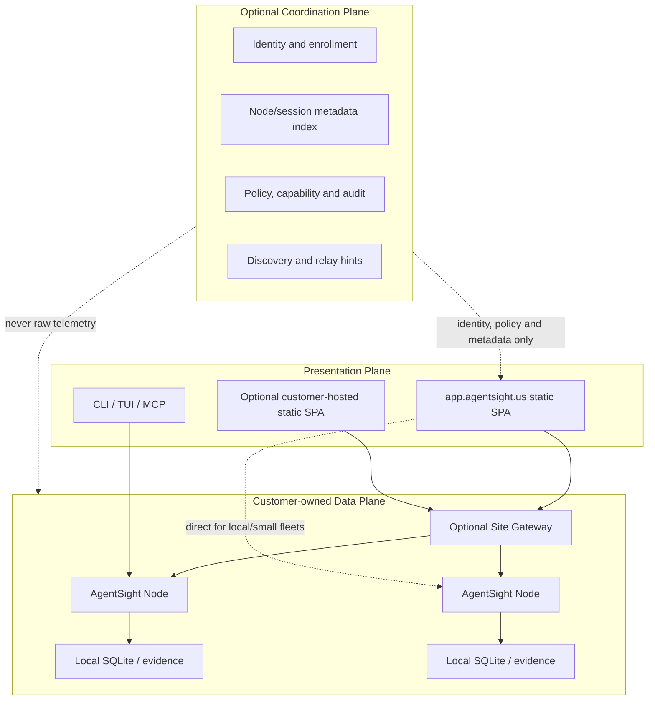

# AgentSight 分布式产品架构：个人本地优先与企业治理

状态：产品设计记录。文中“当前已有”和“需要实现”严格分开；未实现能力不是发布承诺。

记录日期：2026-08-11。

讨论来源：[ChatGPT 分享记录：跨平台代理管理工具](https://chatgpt.com/share/6a7ab2ee-4f9c-83ea-a873-614543f3bbbe)。

## 设计结论

AgentSight 采用一套从个人到企业逐级增强的 local-first 架构，而不是分别维护个人版和
企业版：

> 详细运行时证据由 AgentSight Node 在本地采集、存储和查询；个人模式不需要任何
> AgentSight backend；企业模式只增加 identity、discovery、policy、authorization、
> metadata index 和协作，raw telemetry 仍由 Node 或客户 Site Gateway 持有。

这套设计同时满足两个目标：

- **个人好用**：一个 Node binary、本地 SQLite，以及 hosted static UI 或 CLI/TUI；多机时
  直接复用 SSH、Tailscale、Headscale、WireGuard、LAN 或已有 VPN。
- **企业可管**：在同一个 Node Protocol 之上增加 OIDC、RBAC/capability、enrollment、
  policy、audit、revocation、Site Gateway 和 metadata-only control plane。

企业能力必须是 additive：开启企业模式不能改变本地数据的 authoritative ownership，
关闭或失去控制面也不能让本地 capture 和查询停止。

## 从原始讨论保留的约束

原始分享页包含 52 个可见对话回合：26 条用户消息和 26 条 assistant 消息，正文约
19.3 万字符；其中两个 assistant 回合在分享页本身只有 “Worked for …” 状态，没有
最终答复正文。本文不是逐字转录，而是记录与产品架构有关的最终收敛结果。

讨论中已经否定的方向：

- 不做中心化保存 raw trace 的传统 telemetry SaaS；
- 不要求个人用户先注册 organization、部署 server 或上传数据；
- 不让浏览器直接向数千 Node 无界 fan-out；
- 不开放 arbitrary SQL 作为分布式查询协议；
- 不先自研 WireGuard、NAT traversal、WebRTC 或全球 relay；
- 不为了“企业级”先引入 Kafka、ClickHouse、Redis 和多微服务；
- 当前阶段不实现 research、self-evolution、skill promotion 或 verifier。

最终保留的方向：

- coordination、data、presentation 三个 plane 分离；
- Node 本地数据 authoritative；控制面可选；
- 从单机、direct fleet、managed coordination 到 enterprise gateway 使用同一协议；
- UserIdentity 和 NodeIdentity 分离；
- typed query、capability、deny by default；
- direct path 优先，relay fallback；
- 大规模通过 Site Gateway 做层级 federation，而不是搬入中央 warehouse。

## 三个逻辑平面



### Data Plane

`agentsightd`/AgentSight Node 运行在 laptop、workstation、GPU server、CI runner、sandbox、
Kubernetes node 或 edge box 上。它负责：

- agent-native session discovery；
- 可用时的 eBPF/SSL/process/stdio/system capture；
- 本地 materialization、detection、finding 和 query；
- SQLite、后续可选的 Parquet/CAS，以及 retention/rotation/quota；
- local redaction 和 field disclosure；
- HTTP/WSS Node Protocol；
- control plane 不可用时继续工作。

目标 Node binary 不需要内嵌或 serve 完整前端资源。它只提供 API；默认 UI 是部署在
`app.agentsight.us` 的静态 SPA。CLI/TUI 仍能在没有网页和网络时查询本地 Node。

Node 内部不是永久 full capture，而是两档自适应运行：

```text
Always-on cheap plane
  agent/process discovery, session state, CPU/RSS, health, cheap detection
            |
            | agent active / anomaly / explicit request
            v
On-demand deep capture
  LLM/TLS, tool correlation, file/network effects, stdio, detailed profiling
```

它保存 agent-relevant effects 和 materialized rows，不保存无限 syscall replay。稳定的核心
层级是：

```text
Organization -> Machine -> Agent -> Session -> Turn/Task
  -> LLM Call / Tool Call -> Process -> File/Network/Child Process/Resource Effect
```

每一级都需要稳定 ID 和来源；这是 local UI、OTel、federation、policy 和 detection 共用的
数据契约。

详细 prompt、response、tool argument、process argv、文件路径、网络目标和 raw event 默认只
存在于 Node。短命 Node 需要保留数据时，复制目标是 customer-owned Site Gateway，而不是
AgentSight Cloud。

### Coordination Plane

协调面只负责：

- organization、user 和 OIDC identity；
- Node/Site Gateway enrollment、public key、version 和 last-seen；
- endpoint discovery、relay discovery 和 connectivity hints；
- policy version、capability signing、revocation 和 admin audit；
- allowlisted session metadata，例如 machine、agent、session ID、start、duration、tokens、
  status、risk count 和 data location；
- collaboration、share link 和 billing metadata。

它没有 raw telemetry ingest API，不保存完整 session body，也不参与 Node 的本地 capture
正确性。讨论中的第一版参考部署是静态 SPA + Cloudflare Worker + D1；当前 SPA 由本仓库的
GitHub Pages workflow 发布并经 Cloudflare 自定义域名提供，迁移到 Cloudflare Pages 不改变
协议。Durable Objects 只用于 presence/WSS routing，connection relay 与 control API 逻辑
分离。也可以替换为 Lambda 或一个小型 Rust service，而无需改变 data plane。

### Presentation Plane

Dashboard 只是 Node Protocol 的一个客户端。默认只维护一份部署在
`app.agentsight.us` 的静态 SPA，不在每台 Node serve，也不打包进 Node release。它通过
`LocalProvider`、`DirectFleetProvider` 或 `CloudProvider` 选择数据路径，而不是把数据
位置写死成同源 `/api/v1/snapshot`。Enterprise Gateway 位于 `CloudProvider` 的查询路径
下面，不需要另一套页面。

静态 UI 本身不接收 data plane response：Direct/Local query 从用户浏览器直接发往 Node；
Managed query 通过 relay 传输但不写入控制面数据库。严格 air-gap 或不信任托管 JavaScript
的客户可以在内部静态站点部署同一个 version-pinned bundle；这是 presentation deployment，
不是另一套 data plane。

## 四种部署模式

| 模式 | 组件 | 连接 | 数据位置 | 适用场景 |
| --- | --- | --- | --- | --- |
| Mode 0: Local | 单个 Node API + hosted/cached static UI 或 CLI | localhost | Node SQLite | 个人单机 |
| Mode 1: Direct Fleet | 多个 Node + 静态 Fleet UI | Tailscale/VPN/LAN/SSH tunnel | 各 Node | 个人多机、小团队 |
| Mode 2: Managed Coordination | Node + hosted UI/control + relay | outbound WSS，后续 direct upgrade | 各 Node | 需要零网络配置、登录和协作的团队 |
| Mode 3: Enterprise Site | Global control + Site Gateways + Nodes | gateway federation | Node/site | 多站点和大规模企业 |

模式不是四套产品。它们共享 Node、protocol、schema、query semantics 和 UI provider；差别
只在 coordination provider、transport 和 policy 强度。

### Mode 0：个人单机，无 backend

当前 CLI 已经基本具备这个模式：

```bash
agentsight top
agentsight monitor install-service
sudo agentsight record -- claude
agentsight report serve --db run.db
```

目标体验是打开 presentation SPA 后先自动发现 same-origin AgentSight Node；没有发现时再让
用户连接 Direct Node、登录或进入 demo。`agentsight bind` 默认生成 loopback endpoint，但
Local 不是另一套特殊协议或页面模式。数据仍写入本地 SQLite，用户不需要 Cloud account。当前 release 仍内嵌并 serve UI，这是
待移除的兼容实现，不是最终 presentation architecture。完全离线时使用 CLI/TUI、已缓存
PWA，或在可信网络里部署同一份静态 bundle。

这个变化不改变用户入口：`agentsight top`、`sudo agentsight record -- ...`、
`agentsight report ...` 和 `agentsight monitor install-service` 保持有效。`record`/`report serve`
现有的本地 server 生命周期先保留，但目标职责从“serve 内嵌网页 + API”缩小为“只提供
Node API，并引导浏览器打开 hosted UI”。托管能力是 opt-in；只增加网页引导的一次性
enrollment，不替换现有采集和查询命令。

### Mode 1：个人多机和小团队，Direct Fleet

用户在每台机器运行 Node，并在浏览器或本地配置中保存 node URL registry。用户自带
Tailscale/Headscale、WireGuard、企业 VPN、LAN、public endpoint 或 SSH tunnel；这一档
正式定义为 **Direct Mode: bring your own connectivity**。

当前不改代码也可以逐台使用：

```bash
ssh -N -L 17395:127.0.0.1:7395 workstation
ssh -N -L 27395:127.0.0.1:7395 server
```

统一 fleet 入口仍是 `app.agentsight.us`；目标 `DirectFleetProvider` 通过 authenticated
Node Protocol 查询配置的节点并在浏览器合并，不要求用户学习另一组采集命令。本轮实现的
`agentsight bind` 默认开放 loopback，也允许显式指定 listen IP、port、browser endpoint
和 self-hosted app URL；它把随机 process-lifetime bearer 直接放在 URL fragment 中，SPA
读取后立即清除 fragment，不再增加短码交换协议。现有 `record` server 的兼容接口没有因此变成可公开的远程 API。Direct Mode
不需要 AgentSight backend；SSH 只是现有可用的 tunnel，不是独立 provider。

### Mode 2：Managed Coordination

需要安装后自动 online、跨用户登录、node discovery、policy 和 share link 时，启用轻量
托管控制面：

- 静态 Fleet UI；
- OIDC 和 organization membership；
- Node public key、metadata、policy version 和 endpoint registry；
- 短期 capability；
- Node 主动建立 outbound WSS `:443`，无需公网入口；
- 浏览器查询先保证 relay 可用，后续再尝试升级 direct path。

第一版 Managed connectivity 的原则是 connectivity first：outbound WSS relay 先保证任意
NAT/防火墙后面的节点可用；已有 Tailscale/LAN path 时直接连接，后续才考虑 WebRTC/ICE。
成熟 relay 只转发端到端密文且不持久化 session body；P0 可以先用 TLS relay 验证产品，
但不能宣称 relay 已经 E2E blind。Private deployment 可将 control/relay 放在客户环境。

### Mode 3：Enterprise Site Gateway

浏览器不能向几千个 Node fan-out。企业按 site/region 部署 Gateway：

```text
Global Coordination Plane
  -> Site A Gateway -> Nodes
  -> Site B Gateway -> Nodes
  -> Site C Gateway -> Nodes
```

Gateway 属于 customer data plane，负责：

- node registry、health 和 protocol compatibility；
- typed query fan-out、deadline、并发上限、merge 和 partial result；
- site-local session metadata index、cache 和 aggregation；
- ephemeral Node 的 policy-controlled local replication；
- control-plane policy cache 和授权执行；
- customer-hosted relay、retention 和 export。

扩容方式是增加或分片 Gateway，不是把 raw data 送进 global warehouse。

## 统一的 Node Protocol

现有完整 `Snapshot` endpoint 只能作为迁移期的 local compatibility API，不能成为 hosted
UI 或公开 fleet protocol。统一协议应是版本化、只读、类型化且有资源边界：

```text
GET  /v1/info
GET  /v1/health
GET  /v1/sessions?cursor=&limit=&since=
GET  /v1/sessions/{session_id}/summary
POST /v1/query
GET  /v1/findings?cursor=&limit=&since=
GET  /v1/live
```

`POST /v1/query` 只允许定义好的 filter、aggregation 和 selected fields，不允许 arbitrary
SQL。请求携带 protocol version、scope、deadline、row/byte limit、cursor 和 request ID；
Managed/Enterprise mode 还携带 short-lived capability。

响应必须包含：

- `machine_id`、schema/protocol version；
- namespaced session ID；
- capture completeness 和 view source/confidence；
- result、cursor、truncated 和 partial/unavailable reason；
- query cost，不包含 secret 或 raw request body。

WSS `/v1/live` 只用于有界增量。大型 artifact、数据库和长期 export 使用客户明确触发的
direct/site-local transfer。

## 统一 provider 边界

```text
CoordinationProvider
  NoopCoordination
  StaticConfigCoordination
  AgentSightCloudCoordination

FleetProvider
  LocalProvider
  DirectFleetProvider
  CloudProvider
```

- `NoopCoordination + LocalProvider` 是个人单机；
- `StaticConfigCoordination + DirectFleetProvider` 是个人多机；
- `AgentSightCloudCoordination + CloudProvider` 是托管小团队；
- 同一个 `CloudProvider` 经 Site Gateway 查询大规模企业节点。

这样企业功能不会污染个人路径，个人 dogfooding 的 protocol、identity 和 merge 逻辑又能
直接成为企业底座。

## Identity 和授权

### 个人模式

- Local mode 只监听 loopback，不需要 Cloud 登录；首次访问由 Node 显示一次性 challenge，
  将浏览器生成的 client public key 加入本地 trust policy；
- Direct mode 可以由 Node 创建 scoped local bearer token；
- 更强的 direct auth 采用类似 `authorized_keys` 的 principal public key + capability；
- 浏览器/手机可以生成自己的 key，通过短期 challenge 或 QR 与 Node pairing；
- Git/Ansible/Nix 等可以同步 Node 的 local trust policy；
- Tailscale/Headscale、SSH 和 VPN 只负责 connectivity，AgentSight Node 仍验证自己的
  application capability。

### Managed/Enterprise mode

- **UserIdentity**：OIDC user、organization、role/group；
- **NodeIdentity**：Node 首启生成 Ed25519 keypair，private key 不离开 Node；
- **ClientIdentity**：浏览器/CLI 生成 client key，private key 不上传；
- enrollment token 一次性、短期有效并绑定 organization/site；
- control plane 签发 `principal -> resource -> capability` 的短期授权；
- Node/Gateway 本地验证 capability，默认 deny。

最小 capability：

```text
node.metadata.read
session.metadata.read
session.content.read
process.detail.read
file.detail.read
network.detail.read
policy.manage
node.revoke
```

`session.metadata.read` 不隐含 `session.content.read`。fleet overview 不应获得 prompt、
response、argv、路径或 network target。

### Enrollment flow

```text
1. User -> app.agentsight.us -> OIDC login
2. Control Plane -> one-time join token scoped to org/site, short expiry
3. Node -> generate Ed25519/X25519 keys locally
4. Node -> submit public keys, version, labels and proof-of-possession
5. Control Plane -> register Node and consume join token
6. Node -> authenticate outbound WSS with a signed challenge
```

join token 不能成为长期 Node credential，不能出现在 query string、shell history、analytics
或日志。Node private key 永远不进入 D1、relay 或浏览器。

### Query authorization flow

用户打开静态 SPA 后，控制面根据 OIDC membership、policy、requested Node/resource 和 client
public key 签发短期 signed capability：

```text
issuer              AgentSight Control Plane
subject             user/client principal
audience            exact node_id or site_gateway_id
organization        org_id
capabilities        session.metadata.read, process.detail.read, ...
resource_filter     project/session/time/field constraints
policy_version      monotonic version
confirmation_key    client public key
issued/expires      short lifetime
token_id            unique, auditable identifier
```

浏览器对 request ID、method、path、body hash、timestamp 和 nonce 签名，连同 capability 发给
Node。Node 本地完成：

1. 验证 control-plane signature、issuer、audience、expiry 和 policy version；
2. 验证 client proof-of-possession，防止 capability 被复制后直接重放；
3. 将 typed query 映射到 field/resource capability；
4. 在本地执行 query 和 redaction；
5. 返回允许的结果并记录 disclosure audit。

Direct path 由浏览器直接发送；Managed path 把相同 envelope 经 relay 路由。完成 E2E 后，
浏览器与 Node 用 X25519/协商密钥加密 request/response，relay 只看到 node ID、request ID、
大小和时间等 routing metadata。上线初期若只有 TLS relay，必须明确 relay operator 技术上
能看到内容，不能提前宣称 zero-knowledge。

### Revocation 和离线语义

Node 不应每次 query 都同步调用 control plane，否则 Cloud outage 会破坏本地可用性。
revocation 采用：

- 很短的 capability TTL；
- monotonic policy/revocation epoch；
- online Node 的即时 push；
- Node 本地缓存 control-plane verification keys 和最后有效 policy；
- 企业可配置最大 offline authorization window。

被撤销但离线的 Node 最晚在 capability expiry 后拒绝旧授权。需要更强即时撤销的客户必须
接受“Node 可达”这一前提。

## Hosted UI 的浏览器安全边界

从 `https://app.agentsight.us` 访问 loopback/private Node 是 cross-origin local-network
request。Node 和 SPA 必须共同处理：

- Node 只允许精确 origin `https://app.agentsight.us` 和客户显式配置的 private UI origin，
  禁止当前的 `Access-Control-Allow-Origin: *`；
- 支持 CORS preflight/`OPTIONS`、允许的方法与 authorization headers；
- Chromium Local Network Access permission；SPA 在浏览器支持时声明 local target address
  space，并给用户清楚的授权引导；
- Direct non-loopback endpoint 使用浏览器可信 HTTPS，例如 Tailscale HTTPS 或企业证书；
- 不支持相应 local-network/mixed-content 规则的浏览器改走 Managed relay；
- 所有 API 即使位于 loopback 也需要 anti-CSRF/request signature，不把“本地端口”当身份。

[Chrome Local Network Access](https://developer.chrome.com/blog/local-network-access) 已从
142 开始为 public site 到 loopback/private network 的请求引入 permission。浏览器行为仍
有差异，而且 cross-origin API 仍需正确的
[CORS](https://developer.mozilla.org/en-US/docs/Web/HTTP/Guides/CORS)，因此“CF 页面直接访问
所有本地 Node”不能只靠 CORS `*` 假定可用；Managed relay 是跨浏览器的零配置路径。

另外，E2E relay 不等于完全不信任 UI operator：由 AgentSight 实时托管的 JavaScript 能
接触浏览器中解密后的结果。普通 SaaS 模式将 `app.agentsight.us` 作为受信客户端；要求抵抗
托管前端被替换的企业，应使用可复现、version-pinned、customer-hosted static bundle 或
后续 signed native client。

## 数据分层与隐私

| 数据 | Authoritative location | AgentSight Cloud 默认可见 |
| --- | --- | --- |
| Raw events、prompt/response、argv、path、network target | Node | 否 |
| Session materialized rows | Node；客户策略允许时复制到 Site Gateway | 否 |
| Findings 和 aggregates | Node/Site Gateway | 仅 allowlisted count/status |
| Node identity、version、last-seen | Coordination Plane | 是 |
| Session ID、time、duration、tokens、status、risk count、data location | Coordination Plane | 可按 policy 开启 |
| Policy、capability metadata、admin audit | Coordination Plane | 是 |

本地数据生命周期必须补齐 retention、rotation、quota、migration、recovery、redaction 和
encryption-at-rest。`capture_completeness` 必须明确 eBPF privilege、SSL payload、native
transcript、process/file/network evidence 是否存在；缺数据不能解释成“没有发生”。

对于 Claude/Codex 等已经存在的 native transcript，默认不重复复制全文：Node 保存原文件
reference、content hash 和 normalized index，runtime-only evidence 存入 AgentSight DB。
用户显式执行 `session freeze` 时才生成包含 transcript、provenance 和 blobs 的 portable
bundle；UI 必须标明 referenced content 的 durability 不受 AgentSight 保证。

数据策略不是一个全局开关，而是按环境和字段决定：workstation 可保持 local，CI/sandbox
可在退出时复制到 customer-owned Gateway，security finding 可始终复制到 Gateway，raw
prompt 可以永不复制。AgentSight 托管控制面只支持 `SYNC_NONE`、`SYNC_METADATA` 和
`SYNC_FINDINGS_ONLY`；聊天中早期出现的 hosted `SYNC_FULL` 被后续“只做轻量控制面”决定
取代，完整数据只能进入 Node 或客户持有的 Site Gateway。

## Connectivity 和故障语义

不同模式使用不同的首选连接：

1. Local：localhost；
2. Direct：LAN、Tailscale/Headscale、WireGuard、企业 VPN、public endpoint 或 SSH tunnel；
3. Managed P0：Node/Site Gateway 主动 outbound WSS `:443`，relay 保证先连通；
4. Managed 后续：发现已有 LAN/Tailscale path 时升级 direct，relay 保持 fallback；
5. 只有 relay 成本或 latency 证明必要时，才做 ICE/WebRTC direct upgrade。

控制面与 relay 是两个服务：前者可以 tiny/serverless，后者只做长连接和数据转发。这里
“AgentSight 不托管 data plane”的准确含义是：AgentSight Cloud 不持有权威数据、不保存
session body、不执行客户 telemetry query。Managed relay 是可选的 connection plane；启用
时数据包会经过 AgentSight 网络。要求任何客户 payload 都不经过 AgentSight 的部署使用
Direct/Private Managed；要求 relay operator 看不到内容则必须启用 E2E，不能只依靠 relay
终止的 TLS。WSS 只服务 interactive typed query 和小结果；大型 session/bundle 使用 direct
或客户显式触发的临时加密传输，避免把大文件全部穿过 relay。

控制面不可用时，已 enrollment 的 Node 必须继续：

- capture、materialize 和写入本地 SQLite；
- 本地 finding、retention 和 UI；
- 使用缓存 policy；
- 接受仍有效的已签发 capability 或客户内网授权。

允许暂时失败的是新用户登录、新 Node enrollment、新 policy、跨 site discovery 和新 share
link。这个边界与
[Tailscale control/data plane](https://tailscale.com/docs/concepts/control-data-planes) 和
[Netdata Cloud](https://learn.netdata.cloud/docs/netdata-cloud) 的轻量协调思路一致；
[Pixie architecture](https://docs.px.dev/reference/architecture/) 也提供 node/cluster-local
数据与云端认证代理分离的相邻参考。

## Edge runtime budget

轻量不是自然来自 Rust/eBPF，而是正式产品约束。聊天记录给出的目标而非当前实测承诺是：

```text
Idle:          CPU approximately 0%, RSS target 30–50 MB, network/disk near 0
Normal agent:  CPU overhead target below 2–3%, memory target below 100 MB
No agent:      deep probes dormant
Control link:  sparse metadata, much less than 1 KB/min average
```

release gate 需要真实测量 idle、normal 和 deep-capture 三档，不能直接把目标写成 marketing
数字。实现手段包括 agent-aware probe activation、kernel-side filtering、process-tree scope、
sampling 和 effect aggregation；内部优化目标是单位 CPU/memory/network 获得最多 useful
agent evidence，而不是采集最多 telemetry。

## Enterprise requirements 如何不伤害个人体验

| 企业要求 | Enterprise 增量 | 个人默认 |
| --- | --- | --- |
| SSO / user lifecycle | OIDC，后续 SAML/SCIM | 无登录或 local principal |
| RBAC / least privilege | capability + field-level policy | loopback、scoped token 或 local public key |
| Enrollment / revoke | Node key、one-time token、revocation | static node registry + pairing |
| Audit | admin、policy、query 和 disclosure audit | 本地可选 query log |
| Data residency | Node/site authoritative，metadata allowlist | 所有数据本机 |
| Fleet policy | signed/versioned policy + local cache | local config |
| Scale | Site Gateway hierarchy | 浏览器/CLI 直连少量 Node |
| HA | control API replication；CP outage 不停 capture | 没有 CP 依赖 |
| Upgrade | version negotiation、pinned rollout、rollback | 单 binary 自主升级 |
| Kubernetes/ephemeral | node/site gateway local replication | 不加载相关组件 |

关键原则是企业能力通过 provider 和 policy 加入，而不是给个人 binary 增加必须配置的云
依赖。

## 本轮实现后的当前状态

| 能力 | 当前状态 |
| --- | --- |
| Local `top` | 已支持活跃 agent、process/resource 和 native session；权限允许时增加 eBPF |
| `record` | 已支持启动/attach agent、SQLite 和 live embedded UI |
| `report` | 已支持 summary/token/audit/prompts/export/list/serve |
| Background monitor | 已有 systemd user service，但主要是轻量 process/session 采样 |
| Capture pipeline | 已有 SSL/process/stdio/system、analyzer、MaterializedView 和 sinks |
| Local persistence | 已有 SQLite，但产品化 lifecycle 仍不完整 |
| Container targeting | 已支持 Docker/Kubernetes binary resolution |
| Static app | `app.agentsight.us` 托管本仓库 SPA；无连接时明确选择 Bind、OAuth 登录或 recorded demo |
| Node bind | `agentsight bind` 用 URL fragment 交付随机 process-lifetime bearer；默认自动发现 loopback，但可指定 listen IP、port、browser endpoint 和自托管 app URL；Node ID 持久化，token 随进程失效 |
| Direct API | `/api/v1/info` 和 bearer-protected `/api/v1/snapshot`；CORS origin 来自本次选择的 hosted/self-hosted app；bind 默认读取最新 SQLite 或本地 session index |
| Cloud control | Cloudflare Worker + D1 已实现带浏览器 PKCE 的 GitHub/Google OAuth flow、session 和 owner-scoped Direct Node metadata registry；不接收 snapshot；provider 上线仍需配置四个 OAuth secrets |
| Managed relay/Gateway | 尚未实现；当前跨机仍需 BYO connectivity，登录不会让不可达 Node 自动上线 |

本轮是可 dogfood 的 Local/Direct saved-session/index 切片，不是跨进程 eBPF live relay 或完整
enterprise claim：仍保留 embedded assets
以兼容旧入口；Snapshot 仍是迁移接口；direct access 仍是 process-lifetime bearer，而不是
浏览器 key + proof-of-possession；organization、RBAC/capability、revocation、managed relay、
Site Gateway 和 bounded typed query 仍未完成。Node API 不能直接暴露到公网、LAN 或 tailnet；
公开协议还必须补齐 HTTPS、pagination、deadline、response limit 和 disclosure policy。

## 还差哪些部分

### 完整产品的共用底座

1. 稳定的 Machine → Agent → Session → Turn/Task → LLM/Tool → Process → Effect identity
   和 causal/provenance graph；
2. `view_source`、confidence、capture completeness 和 schema/protocol version；
3. 正式 `agentsightd` lifecycle，将 always-on cheap plane 与按需 deep capture 组合；
4. typed、bounded、只读 Node Protocol；
5. retention、rotation、quota、migration、recovery、local redaction 和 native-log reference；
6. local detection engine：retry loop、token anomaly、process explosion、repeated compilation、
   new destination、privilege/secret access；
7. 将前端从 Node binary/同源 Snapshot 解耦为静态 SPA，并实现 `FleetProvider` 和
   `CoordinationProvider` 抽象；
8. capture capability matrix，明确 native/eBPF/TLS/derived/unsupported。

### 个人和小团队首先需要

1. static node registry；
2. `DirectFleetProvider`；
3. scoped local token、public-key trust 和 pairing；
4. 保留现有 CLI 入口，在 hosted UI 中增加 multi-node navigation；
5. snapshot merge、timeout、offline 和 partial-result UI；
6. Tailscale/VPN/LAN/SSH tunnel 等 BYO connectivity。

这些完成后，个人就有无需 backend 的统一多机体验，同时验证企业 federation 最关键的
protocol 和 merge semantics。

### 企业随后增加

1. UserIdentity、NodeIdentity、enrollment、rotation 和 revoke；
2. OIDC、organization、capability、field policy 和 admin audit；
3. metadata-only control plane 和 node/site discovery；
4. Site Gateway 的 index、cache、aggregation 和 ephemeral retention；
5. outbound WSS/TLS relay，随后 E2E relay、direct upgrade 和 private deployment；
6. version rollout、rollback、HA、SAML/SCIM 和 enterprise runbook。

### 可上线的最小 SaaS 切片

首版不重写 collector、capture pipeline 或 SQLite，也不把完整 provenance、local detection、
Site Gateway 和 storage lifecycle 都设为 SaaS 上线前置条件。工具侧只增加一个薄的
remote-access adapter：

1. 首启生成并持久化 Node key；
2. 在现有 materialized view 之上增加少量 authenticated、bounded API；
3. 在现有 direct bearer 之外增加可撤销的 managed enrollment；
4. 后台服务可选建立 outbound WSS，并复用同一个授权校验和 query handler；
5. 移除 Node release 对前端 assets 的依赖，但保持现有 CLI 命令和本地离线能力。

最小 hosted stack 只有：静态 SPA（当前 GitHub Pages，也可换 Cloudflare Pages），OIDC/
organization/Node registry/capability signing API，D1 中的 identity/public key/policy/
allowlisted metadata/admin audit，
以及 Node 主动连接的 WSS routing/relay。不需要 Kafka、ClickHouse、对象存储或 raw ingest。

上线的真正安全阻塞是 Node/client identity、一次性配对、短期 capability +
proof-of-possession、revocation、精确 CORS/LNA，以及 relay 的资源边界。如果宣传
“AgentSight 看不到查询内容”，E2E 也是发布阻塞；如果首版先使用 TLS relay，则必须如实
宣传为“不持久化、不建设中央 telemetry store”，而不是 zero-knowledge。

## 当前发布阻塞与非阻塞项

截至 2026-08-11：

- 最新 release 是 [v1.0.5](https://github.com/eunomia-bpf/agentsight/releases/tag/v1.0.5)；
- [Issue #22](https://github.com/eunomia-bpf/agentsight/issues/22) 的 Linux ARM64 release
  已由 master 上的 CI/release 改动关闭；
- [PR #144](https://github.com/eunomia-bpf/agentsight/pull/144) 的 session-level OTel trace
  correlation 尚未合入 master；
- [PR #148](https://github.com/eunomia-bpf/agentsight/pull/148) 的 audit source/confidence
  provenance 尚未合入 master。

Linux x86_64 个人本地使用不被这些事项阻塞。ARM64 是相应设备的发布阻塞；audit
provenance 是跨来源 merge 的 P0；OTel session correlation 是标准化 export 的 P0，但不是
Direct Fleet 本地查询的前置条件。

## 实施顺序

架构实施应从共同底座向外扩展，而不是先造企业 backend：

1. 保持现有 `top`/`record`/`report`/`monitor` 入口和 capture/storage 路径不变；
2. 将静态 SPA 与 Node binary 解耦，在现有 view 上加最小 bounded Node API；
3. 加入 Node/client key、managed enrollment 和 capability validation；
4. 交付 Local/Direct provider，并让后台服务可选建立 outbound WSS；
5. 上线 metadata-only coordination，先用明确披露信任边界的 relay 自己 dogfood；
6. 再补 E2E、direct-path upgrade、provenance/detection/storage lifecycle；
7. 最后按真实企业需求加入 Site Gateway、HA 和 identity lifecycle。

这条顺序让每一步都产生可用产品：个人模式不是被企业版淘汰的临时实现，而是企业数据面
的最小、可独立运行单元。

## 明确不做

- AgentSight-hosted raw telemetry warehouse；
- cloud prompt/response、argv、path 或完整 provenance 默认存储；
- 个人模式强制登录、organization 或 backend；
- 公开 unauthenticated snapshot API；
- 自研底层 VPN 作为产品前置条件；
- arbitrary SQL federation；
- 浏览器向大规模 Node 无界 fan-out；
- 为尚未出现的规模提前部署 Kafka/ClickHouse/Redis/microservices；
- 将 research、self-evolution 或 skill promotion 混入当前产品上线范围。

## 最终产品形态

```text
AgentSight Node
  one binary, unchanged CLI, local capture, local evidence, local query API

AgentSight UI
  one static SPA over Local / Direct / Cloud providers

AgentSight Cloud
  optional lightweight coordination: identity, policy, discovery, metadata
```

个人用户获得的是一个不依赖云、可逐步扩到多机的 AgentSight；企业获得的是在同一
customer-owned data plane 上增加治理、规模和协作，而不是另一套中心化 telemetry 产品。
