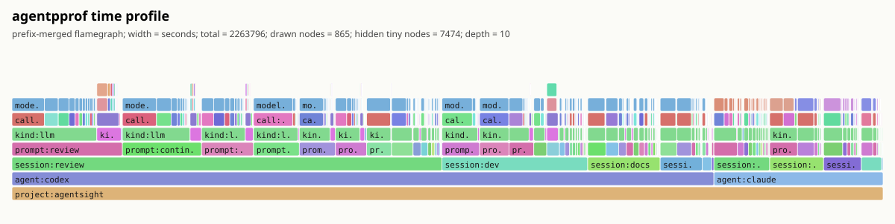
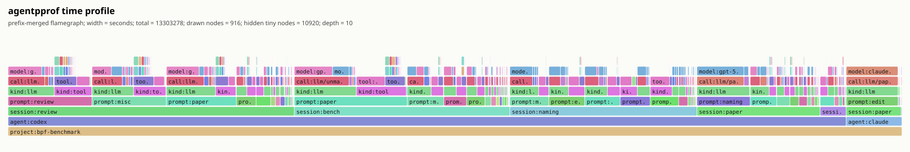
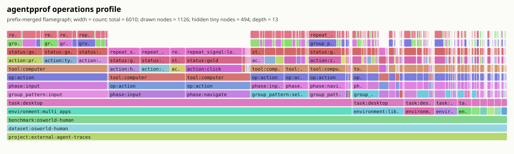

# AgentSight Flamegraph Gallery

AgentSight's semantic flamegraphs connect agent intent to observable activity.
Each horizontal frame adds context to the stack, while frame width represents
the selected metric: token volume, elapsed time, system-effect weight, or
operation count. The examples below cover both local development sessions and
external agent-trajectory datasets.

## R221 Semantic Flamegraph

The R221 presentation view prefix-merges the 200 highest-weight semantic stacks
from the R170 research dataset. Its fixed colors identify frame roles: project,
agent, session, prompt, tool call, process, effect, path, and status. Width is
aggregated system-effect weight, so the figure highlights repeated causal paths
rather than a chronological trace. This research view uses a top-down icicle
orientation and is intended for explaining the intent-to-effect model.

## AgentSight Development Time

This profile uses real AgentSight development sessions. Width represents
elapsed seconds, and the uneven stack height comes from optional LLM, tool, and
event frames. It is the closest project-native example to a traditional CPU
flamegraph silhouette. Regenerate it with [`agentsight.sh`](agentsight.sh).

## BPF Benchmark Development Time

This profile uses real `bpf-benchmark` development sessions and also measures
elapsed seconds. Its variable-depth stacks produce the strongest ragged upper
outline in the gallery, making the separation between review, paper, naming,
benchmark, and editing sessions easy to see. Regenerate it with
[`bpf-benchmark.sh`](bpf-benchmark.sh).

## OSWorld-Human Operation Stacks

This research profile projects 6,010 labeled operations from the external
OSWorld-human trajectory dataset into task, group-pattern, phase, operation,
tool, action, status, and repeat-state frames. Width represents operation count.
Unlike the local time profiles, it demonstrates how the same renderer handles a
deep operation schema and should not be interpreted as AgentSight development
activity.

## Choosing a View

- Use **R221** to explain semantic intent-to-effect aggregation.
- Use **AgentSight time** when the example must come from this repository's own
  development history.
- Use **BPF benchmark time** when a visibly variable stack silhouette matters.
- Use **OSWorld-human operations** to demonstrate deep external-trajectory
  schemas.

For the profiler data model, available views, tagging workflow, and CLI usage,
see [`docs/agentpprof.md`](../agentpprof.md).
