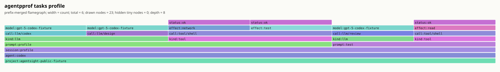
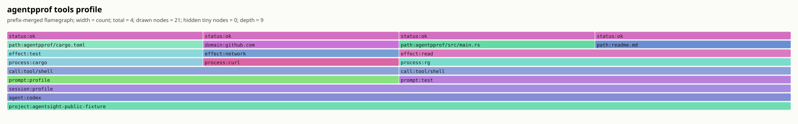
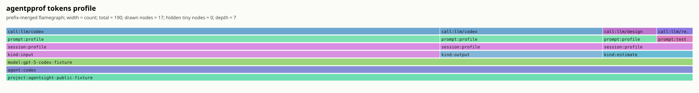
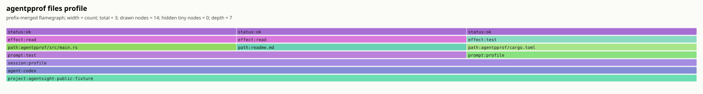
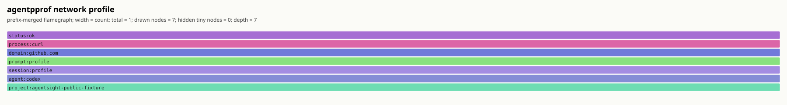

# Agent Flamegraphs

`agentpprof` turns local Codex and Claude Code sessions into pprof-style
semantic profiles. The SVG output is a prefix-merged flamegraph: shared stack
prefixes are drawn once, and each frame width is the inclusive weight below
that frame.

Read the SVG from bottom to top. The lower frames are broader context such as
`project`, `agent`, `session`, and `prompt`; upper frames are the more specific
activity such as LLM calls, tools, processes, file effects, network domains,
and status.

## Public Fixture

Use the committed synthetic fixture when you want a reproducible example that
does not read private `~/.codex` or `~/.claude` history:

```bash
cargo run --manifest-path agentpprof/Cargo.toml -- \
  --project-root . \
  --project-name agentsight-public-fixture \
  --session-file agentpprof/examples/codex/sessions/2026/06/18/public-agentpprof-fixture.jsonl \
  --tagger regex \
  --no-cache \
  --view tasks \
  -o docs/flamegraph/examples/public-fixture-tasks.svg
```

The same fixture can be projected into all supported flamegraph views:

```bash
for view in tasks tools tokens files network; do
  cargo run --manifest-path agentpprof/Cargo.toml -- \
    --project-root . \
    --project-name agentsight-public-fixture \
    --session-file agentpprof/examples/codex/sessions/2026/06/18/public-agentpprof-fixture.jsonl \
    --tagger regex \
    --no-cache \
    --view "$view" \
    -o "docs/flamegraph/examples/public-fixture-${view}.svg"
done
```

## Views

| View | Width means | Use it to answer | Stack shape |
| --- | ---: | --- | --- |
| `tasks` | LLM-call plus tool-event count | What work dominated this session? | `project -> agent -> session -> prompt -> kind -> call -> model/effect/status` |
| `tools` | Tool-event count | Which tools, processes, effects, paths, or domains were heavy? | `project -> agent -> session -> prompt -> call:tool/* -> process... -> effect -> path/domain -> status` |
| `tokens` | Reported or bounded-estimated token count | Which semantic regions consumed model budget? | `project -> agent -> model -> kind(input/output/cache/...) -> session -> prompt -> call` |
| `files` | File/path effect count | Which prompts touched which path groups? | `project -> agent -> session -> prompt -> path -> effect -> status` |
| `network` | Network/domain effect count | Which prompts contacted which domains, through which processes? | `project -> agent -> session -> prompt -> domain -> process... -> status` |

Start with `tasks`, then switch to the narrower views when a wide frame needs
explanation.

## Example Gallery

These examples are generated from the public fixture above.

### Tasks



### Tools



### Tokens



### Files



### Network



## Output Formats

The output extension selects the common format when `--format` is not provided:

```bash
agentpprof -o tasks.svg --view tasks       # prefix-merged SVG flamegraph
agentpprof -o tools.folded --view tools    # folded stacks for inferno/flamegraph.pl
agentpprof -o tokens.pb.gz --view tokens   # Go pprof protobuf
agentpprof -o files.json --view files      # redacted session summary plus stack table
```

Open pprof output with standard Go tooling:

```bash
go tool pprof -top tokens.pb.gz
go tool pprof -http=:0 tokens.pb.gz
```

Folded stacks are plain text:

```text
project:agentsight-public-fixture;agent:codex;session:profile;prompt:test;kind:tool;call:tool/shell;effect:read;status:ok 1
```

## Tagging

The default tagger is deterministic and does not call a model:

```bash
agentpprof -o tasks.svg --tagger regex
```

Add project-specific rules with repeated `--tag-rule` arguments:

```bash
agentpprof -o tasks.svg \
  --tagger regex \
  --tag-rule prompt:review='(?i)review|diff|regression' \
  --tag-rule prompt:test='(?i)cargo test|pytest|unit test'
```

Rule syntax is:

```text
KIND:TAG=REGEX
```

`KIND` may be `session`, `prompt`, `llm`, or `all`. Rules are evaluated in
command-line order before the built-in keyword rules. The custom rule regex
matches the current object text only: a `prompt:*` rule matches prompt text, not
the session tag or model hint. `TAG` must be one lowercase English word between
3 and 12 letters, which keeps the flamegraph readable.

For model-produced one-word tags, run a llama.cpp-compatible server and switch
to the LLM tagger:

```bash
llama-server -m /path/to/model.gguf --port 8080
agentpprof -o tasks.svg --tagger llm --llama-url http://127.0.0.1:8080
```

`--tag-rule` is intentionally limited to `--tagger regex`; combining it with
`--tagger llm` returns an error instead of silently mixing policies.

## Local History

Without `--session-file`, `agentpprof` scans recent local Codex and Claude Code
sessions that match `--project-root`:

```bash
agentpprof --project-root /path/to/repo --view tasks -o tasks.svg
```

Local histories can contain prompts, paths, tool outputs, and model responses.
Use explicit `--session-file` inputs for public artifacts and reproducible
examples. JSON output redacts previews by default; only pass
`--include-previews` for private debugging or already-sanitized sessions.

Useful selectors:

```bash
agentpprof -o tasks.svg --agent codex
agentpprof -o tasks.svg --session-id 019ec5
agentpprof -o tasks.svg --session-tag profile
agentpprof -o tasks.svg --prompt-tag review
```

## Regenerating These Examples

The committed examples in this directory were generated with:

```bash
for view in tasks tools tokens files network; do
  cargo run --manifest-path agentpprof/Cargo.toml -- \
    --project-root . \
    --project-name agentsight-public-fixture \
    --session-file agentpprof/examples/codex/sessions/2026/06/18/public-agentpprof-fixture.jsonl \
    --tagger regex \
    --no-cache \
    --view "$view" \
    -o "docs/flamegraph/examples/public-fixture-${view}.svg"
done

cargo run --manifest-path agentpprof/Cargo.toml -- \
  --project-root . \
  --project-name agentsight-public-fixture \
  --session-file agentpprof/examples/codex/sessions/2026/06/18/public-agentpprof-fixture.jsonl \
  --tagger regex \
  --no-cache \
  --view tasks \
  -o docs/flamegraph/examples/public-fixture-tasks.folded

cargo run --manifest-path agentpprof/Cargo.toml -- \
  --project-root . \
  --project-name agentsight-public-fixture \
  --session-file agentpprof/examples/codex/sessions/2026/06/18/public-agentpprof-fixture.jsonl \
  --tagger regex \
  --tag-rule prompt:survey='(?i)profile the repository' \
  --no-cache \
  --view tasks \
  -o docs/flamegraph/examples/public-fixture-tag-rule.folded
```
