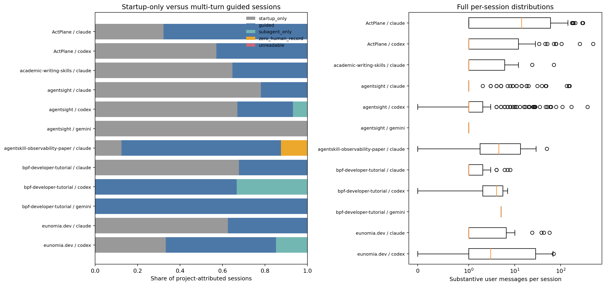
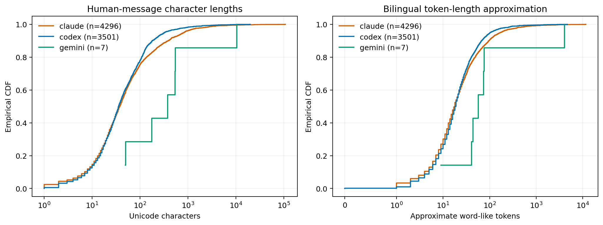
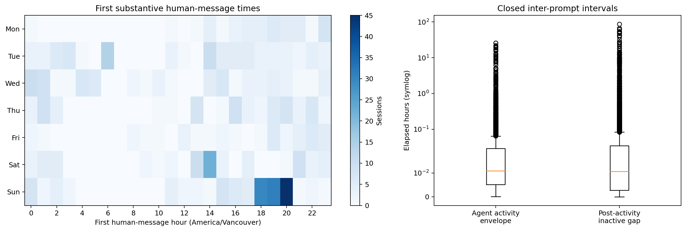
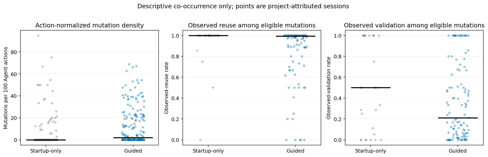
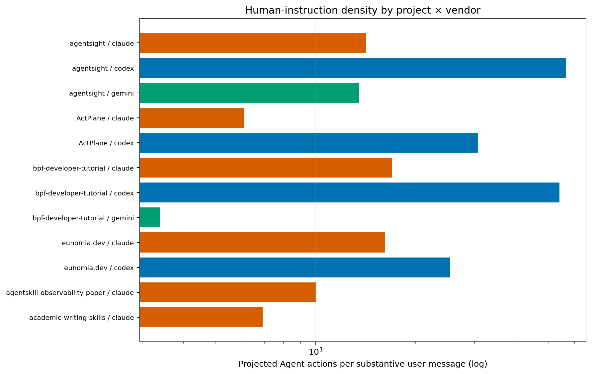

# Human involvement in the final RQ1--RQ4 natural corpus

## Result at a glance

The fixed projection contains **551 project-attributed session memberships**
but **550 unique projected session identifiers**: one session contributes to
two projects. Native candidate sources were readable for
**1049/1049** project-session source mappings. The six event
exports contain the registered
**181,303 projected Agent actions**; the source-call-ID sensitivity contains
**180,987** distinct project-attributed
call IDs.

Across the 550 unique session identifiers, the source-native adapters recover
**7,804 substantive user messages** and
**1,774,594 Unicode characters**
(approximately **425,434 bilingual word-like
tokens**). That is one substantive user message per
**23.2 projected Agent actions**
(4.30 messages per 100
actions). This is an interaction-volume ratio, not an autonomy score.

Of 532 sessions with at least one substantive human
message, **337 (63.3%)** are
startup-only and **195 (36.7%)** are
multi-turn guided. The remaining 18 identifiers comprise
**17 subagent-only sessions**, **1 other session with no
recoverable substantive human record**, and **0 with
unreadable sources**. The median session contains
**1.0** user messages (IQR
1.0--6.0;
p90 37.1), so the distribution, rather than
the mean, is the central result.

## Data and reconstruction contract

- Corpus membership and Agent actions come only from
  `rq1-rq4-recompute-final/rq1-raw/events/*.json`; paired `.json.gz` files are
  byte-identical after decompression and are not double-counted.
- Claude uses `type=user`, Codex uses `event_msg/user_message`, and Gemini uses
  `messages[].type=user`. Codex response-item messages are fallback-only.
  For Codex, native `session_meta.thread_source` overrides the projection:
  `subagent` rollout files are excluded from human-message extraction even
  when projected as `source_role=user`, while their projected actions remain
  in the Agent-action denominator. Root/user sources are admitted; tool
  results, system/developer records, continuation summaries, local-command
  wrappers, and synthetic interruption notices are not human messages.
- A conversational turn is a substantive human message or a native assistant
  record containing conversational text. Tool results and tool-only assistant
  records are not conversational turns. Because vendors persist commentary and
  assistant messages differently, user turn share is reported in CSV but not
  used as a cross-vendor autonomy measure.
- Character count uses normalized Unicode code points. The word-like count
  treats Latin/digit runs as tokens and individual Han characters as
  approximate tokens; it is not Chinese word segmentation.
- **12 legacy Codex files** predate
  `thread_source` and are admitted from their root-like `cli`, `vscode`, or
  `exec` metadata. The **4 user-role messages from
  `exec`-origin files** cannot be distinguished as direct typing versus
  wrapper/script submission; this is negligible in count but remains a source
  attribution caveat.
- The script keeps message text only transiently for filtering and length measurement; no message text or text hash is exported.

## 1. Human turns and message lengths

The 7,804 unique human messages have median
**37.0 characters** (IQR
17.0--93.0;
p90 268.0) and median
**18.0 approximate word-like tokens** (IQR
9.0--36.0).
The long tail includes pasted code, documents, and prior model output, so total
characters are submitted context volume, not a typing-time estimate or proof
that every character was authored by the human.

### Project × vendor profile

| Project | Vendor | Sessions | User messages | Startup / guided | Actions / user msg | Human chars |
| --- | --- | --- | --- | --- | --- | --- |
| agentsight | claude | 123 | 886 | 96 / 27 | 14.1 | 450,530 |
| agentsight | codex | 176 | 1,505 | 118 / 46 | 56.5 | 207,341 |
| agentsight | gemini | 2 | 2 | 2 / 0 | 13.5 | 923 |
| ActPlane | claude | 62 | 2,955 | 20 / 42 | 6.1 | 529,595 |
| ActPlane | codex | 77 | 1,568 | 44 / 33 | 30.8 | 152,169 |
| bpf-developer-tutorial | claude | 31 | 62 | 21 / 10 | 17.0 | 165,836 |
| bpf-developer-tutorial | codex | 3 | 11 | 0 / 2 | 54.1 | 640 |
| bpf-developer-tutorial | gemini | 1 | 5 | 0 / 1 | 3.4 | 11,262 |
| eunomia.dev | claude | 24 | 205 | 15 / 9 | 16.2 | 54,160 |
| eunomia.dev | codex | 27 | 417 | 9 / 14 | 25.3 | 100,392 |
| agentskill-observability-paper | claude | 8 | 99 | 1 / 6 | 10.0 | 25,755 |
| academic-writing-skills | claude | 17 | 137 | 11 / 6 | 6.9 | 80,639 |

Empty project × vendor cells remain in the CSVs. Cells with fewer than ten
sessions are descriptive points only; this report makes no directional claim
for them.

## 2. Follow-up, interruption, and immediate action change

There are **7,272** follow-up user messages and
**634** explicit native interruption/abort markers.
The follow-up volume is
**4.01
per 100 projected Agent actions**.
Only **593** follow-ups are preceded by such
a marker
(8.2%);
ordinary follow-up is not called interruption.

For immediate action change, the analysis requires both adjacent actions in
the same native human-bearing source file and source stream. This yields
**7,035/7,272** eligible
follow-ups. The exact tool changes for
**3,504**
(49.8%);
the normalized tool family changes for
**3,479**
(49.5%).
Both sides have a file/path target for **2,296**
follow-ups; among them the path set changes for
**906**
(39.5%)
and becomes disjoint for
**855**
(37.2%).
These are immediate observable switches, not semantic goal-redirection labels.

Restricting to the **593 follow-ups with an
explicit interruption/abort marker**, **577**
have comparable adjacent actions. Exact tool changes occur for
**291**
(50.4%),
and tool-family changes for
**286**
(49.6%).
Among **189** path-comparable explicit
interruptions, **81**
change path set and
**70**
become disjoint. This is the closest observable answer to “did the Agent
redirect after interruption,” but it still measures the next tool/path only.

Agent-to-human question tools and source-native approval-like record types are
reported separately in `approval_visibility.csv`. The adapters found
**0 explicit approval-like native records** and
**8069 repeated permission-policy configuration
records**, spanning `acceptEdits, auto, bypassPermissions, default, dontAsk, never, on-request, plan`. A policy record (for
example Codex `never` or `on-request`) is not an individual approval. Absence
of a visible approval record means only that the native source did not expose
one under the frozen rule.

## 3. Schedule and observable wall-clock envelopes

Recoverable first-human-message times peak at 20:00 (67), 19:00 (56), 14:00 (43); the most frequent
weekdays are Sunday (154), Tuesday (81), Saturday (74), all in `America/Vancouver`. Subagent-only and other
zero-human-record sessions have no human initiation time and are excluded from
this schedule.

Across **6,779** closed inter-prompt intervals with
observable Agent activity, the median prompt-to-last-activity envelope is
**0.65 minutes** (IQR
0.31--1.74;
p90 5.71). The median post-activity inactive
gap before the next human message is **0.64
minutes** (IQR 0.17--
2.09; p90
9.66). Summed over unique sessions, the observed
envelopes are **789.8 h** and
the post-activity gaps are **2228.5 h**;
the latter is 73.8% of their summed
two-part envelope.

This does **not** answer how many wall-clock hours the human was attentive.
The logs do not observe reading, thinking, multitasking, typing onset, or
whether an Agent had actually completed and was waiting. Overnight and
between-task idle time can dominate the inactive gap, while prompt-to-last
activity is an elapsed envelope rather than CPU-active work. The defensible
answer is therefore: instruction volume and response timing are measurable;
human cognitive attention time is not.

## 4. Guidance density and output co-occurrence

The primary categorical contrast is startup-only versus multi-turn guided. A
second sensitivity freezes guidance density as follow-up user messages per 100
projected Agent actions and compares bottom/top thirds within each project ×
vendor stratum only when its 33rd and 67th percentiles separate. Middle thirds
are omitted from that contrast. Ties at either threshold are retained, so the
reported groups are not forced to equal size. Both contrasts are descriptive;
assignment is not random, and task difficulty, session duration, project,
vendor, and action volume all remain competing explanations.

### Startup-only versus guided

| Group | Sessions | Median actions | Median mutations | Median mutations / 100 actions | Pooled reuse | Pooled validation |
| --- | --- | --- | --- | --- | --- | --- |
| startup_only | 337 | 7.0 | 0.0 | 0.00 | 95.3% | 31.5% |
| guided | 196 | 216.5 | 6.0 | 1.88 | 93.9% | 29.6% |

These outcome tables retain project attribution, so the one session ID mapped
to two projects appears twice: the guided row has 196 memberships versus 195
unique session IDs in the corpus profile above.

### Within-stratum guidance-density thirds

| Group | Sessions | Median actions | Median mutations / 100 actions | Pooled reuse | Pooled validation |
| --- | --- | --- | --- | --- | --- |
| low | 107 | 24.0 | 0.00 | 89.2% | 15.7% |
| high | 73 | 199.0 | 0.84 | 95.4% | 12.9% |

Reuse and validation denominators contain all non-delete eligible mutations and
retain every observed, competing (`competing_delete` for reuse and
`competing_supersede` for validation), censored-end, and missing outcome.
Sessions with zero mutations remain in action and mutation-density
distributions. Raw
mutation counts are shown beside action-normalized density specifically to
expose the mechanical relation between longer/more active sessions and more
opportunities to mutate.

## 5. Human involvement profile

The compact corpus profile is:

- 7,804 substantive user messages and
  1,774,594 submitted characters across 550 unique
  projected session identifiers;
- 181,303 project-attributed Agent actions, or one
  human message per 23.2
  actions;
- 634 explicit interruption/abort
  markers and 12 visible Agent question
  tools;
- a mixed distribution of 337 startup-only, 195 multi-turn guided,
  and 17 subagent-only sessions, rather than one uniform autonomy
  regime.

## Limitations

This is a six-case, author-associated, natural-use corpus. Project × vendor
strata mix time, task, model, harness, and repository differences. One session
identifier is attributed to two projects; overall human totals deduplicate it
while project tables retain both attributions. Some projected session IDs are
native subagent threads and therefore have no direct human messages. Native
assistant-message granularity differs by vendor. Immediate action changes are
not semantic intent changes.
Character volume includes pasted material. Approval visibility is
source-format-dependent. Finally, action, mutation, reuse, and validation
associations are not causal effects of human guidance.

## For the paper

Across 550 unique projected Agent session identifiers (551
project-attributed memberships),
we recover 7,804 substantive human messages and
1,774,594 submitted characters from source-native
Claude, Codex, and Gemini records. This corresponds to one human message per
23.2 projected Agent actions.
Among the 532 sessions with at least one substantive human message,
63.3% are startup-only, whereas
36.7% contain multi-turn human guidance.
Explicit interruption markers are substantially narrower than follow-up
guidance and are reported separately. Higher and lower guidance-density
sessions differ descriptively in action, mutation, reuse, and validation
distributions, but these contrasts do not identify a causal effect because
task, project, vendor, duration, and author steering are jointly varying.

## Dataset positioning: confound or feature?

**Both, depending on the claim.** Author involvement is a confound for claims
about autonomous Agent behavior, vendor differences, or guidance causing
artifact outcomes: the corpus records a coupled human--Agent process, and the
same author selected tasks, supplied context, interrupted, and supplied
follow-up instructions.
It is also a feature for the paper's defensible naturalistic positioning:
these traces capture real mixed-initiative, persistent-workspace collaboration
that startup-only benchmarks omit. The honest dataset label is therefore
**author-associated mixed-initiative longitudinal cases**, not autonomous-Agent
population data. The human-involvement measurements should be used to bound
interpretation and stratify findings, not statistically "control away" the
author or claim a general autonomy rate.
