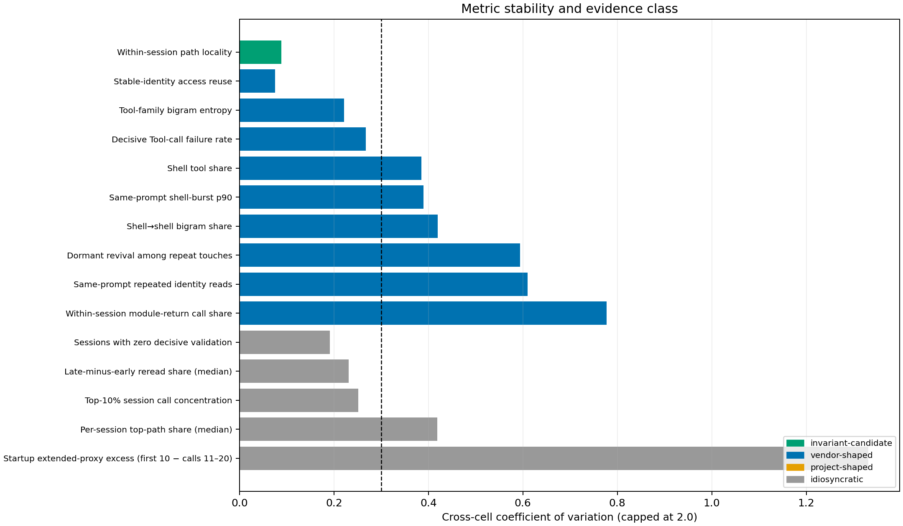
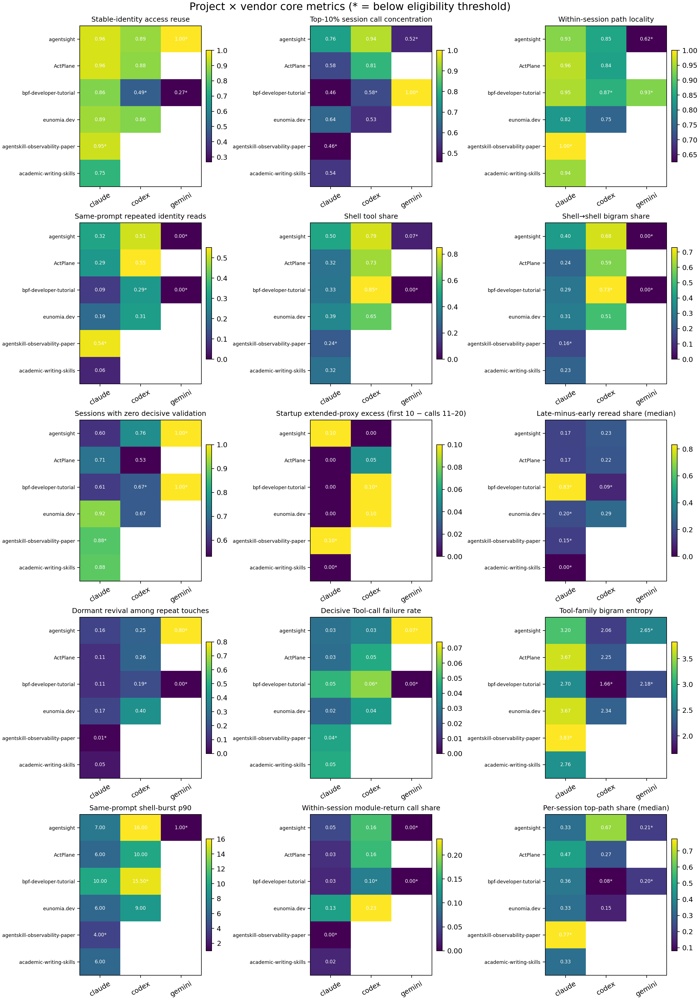
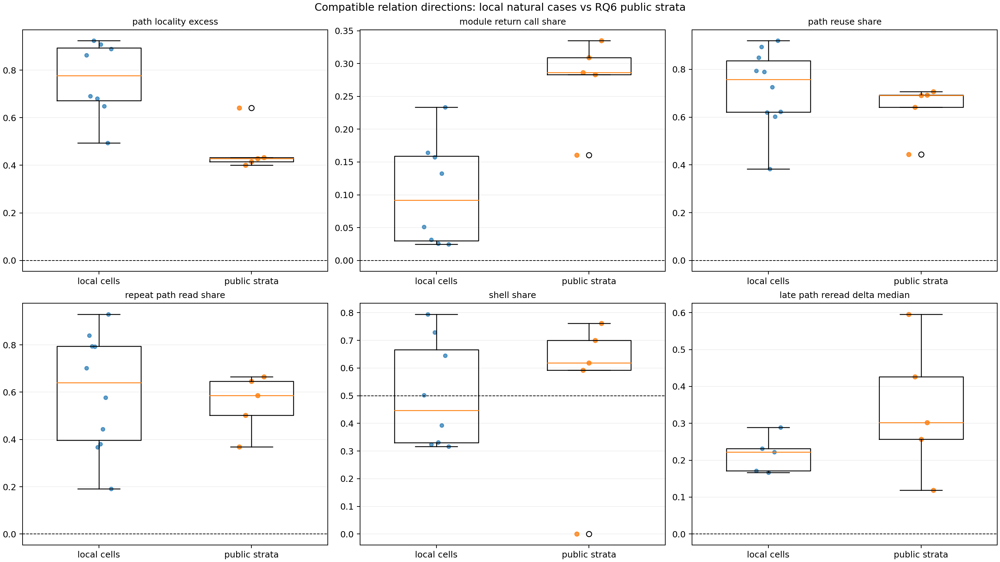
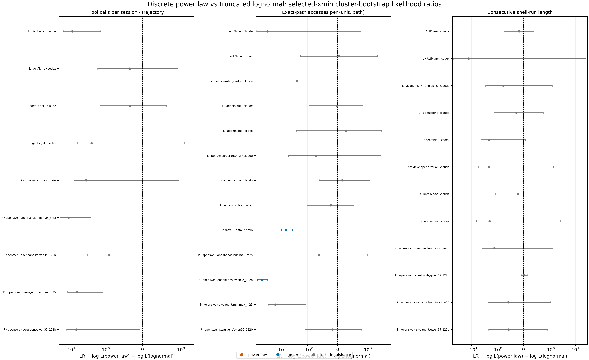

# 共性 pattern 挖掘：跨分层不变性与外部复制

## 结论先行

在预注册的严格门槛下，15 个核心度量中只有 **路径局部性**
（`path_locality_share`）可标为 `invariant-candidate`：8 个合格
project×vendor 格子、5 个项目、3 个完整 Claude/Codex 项目对，跨格子
CV=0.088；“局部路径转移 − 跨模块转移”在所有合格格子同向，逐格
leave-one-out 稳定率为 1.00；RQ6 的 IdeaTrail 和四个 Open-SWE
分层也全部同向且 cluster-bootstrap 95% CI 不跨 0。

其余结果为 9 个 `vendor-shaped`、5 个 `idiosyncratic`，没有任何
`project-shaped` 度量。9 个 vendor-shaped 结论全部只有
`evidence_sufficiency=limited`：它们描述的是三个配对项目中稳定的
Claude/Codex 形状，不能解释成模型或 vendor 的因果效应。五个
idiosyncratic 中，晚期重读只有 5 个合格格子，标签是覆盖不足的暂定
标签；另外若一个比例没有非循环的方向基线，`idiosyncratic` 只表示
“未通过四类判据中的前三类”，并不等于个人癖好。

完整数值见
[`local_grid_metrics.csv`](local_grid_metrics.csv)、
[`metric_classification.csv`](metric_classification.csv) 和
[`external_replication_summary.csv`](external_replication_summary.csv)。

## 数据、单位与核对

分析遵循 [`plan.md`](plan.md) 的冻结定义。每个“至少 10 个会话”门槛
都指为该度量贡献分母的会话，而不是格子内任意会话。Gemini 仍出现在
6×3 全格子中，但样本过少，未进入稳定性判定。

| 核对项 | 结果 |
|---|---:|
| 本地显式格子行 | 6 项目 × 3 vendor × 15 度量 = 270 |
| 本地 Tool calls | 181,303 |
| RQ6 公开轨迹 | 320（5 分层，各 64） |
| `action_gap_gt_100` 复活次数 | 11,271，与 `rq-extensions-final` 完全一致 |
| 哈希记录的直接输入 | 351 个文件 |
| RQ7 heldout 访问 | false |

上述机械核对在 [`reconciliation.csv`](reconciliation.csv)；
全部输入 SHA-256 在 [`input-manifest.csv`](input-manifest.csv)。分析未改
`docs/paper/`，未执行 git 写操作。

## 稳定性判据

主门槛为：至少 6 个合格格子、至少 4 个项目、Claude 与 Codex 均出现、
至少 2 个完整 vendor 对；跨格子 CV<0.30；存在非循环的方向 contrast，
同向率≥0.80；逐格 leave-one-out 通过率≥0.80；可在 RQ6 兼容复算的
度量还必须真正外部复制。

vendor/project 形状仅在 AgentSight、ActPlane、eunomia.dev 的 3×2
完整子格上计算。`vendor-shaped` 要求 vendor SS share≥0.50、三个项目
Codex−Claude 同号，且至少 2/3 的 leave-one-project-out 仍保持该类；
`project-shaped` 对应 project SS share≥0.50、跨 vendor 项目秩
Spearman ρ≥0.50，并通过同样的 leave-one-project-out 门槛。

Top-10% 集中度和 top-path share 只报告幅度，不使用“减去有限支持均匀
最小值”作为方向，因为该差值按定义不会为负。复用率、失败率、熵和
burst 等无非循环方向基线的度量也不能只凭“都大于零”成为 invariant。

## 15 个度量的结论表

| 度量 | 合格格子 | CV | 类别 | 证据与边界 |
|---|---:|---:|---|---|
| 稳定身份访问复用率 | 8 | 0.075 | `vendor-shaped`（limited） | 原始幅度很稳定，但三项目配对子格 vendor SS=0.62、Codex−Claude 三项目同为负；无非循环方向和公开身份复制 |
| Top-10% 会话调用集中度 | 8 | 0.251 | `idiosyncratic` | 本地 0.457–0.939，公开语料仅 0.144–0.207；只有幅度，无合法方向；project SS=0.57 但 leave-one-project-out 仅 1/3 |
| 路径局部率 | 8 | 0.088 | **`invariant-candidate`** | 原始局部率均值 0.881；contrast 0.494–0.924，8/8 同向，逐格 LOO=1.00，RQ6 复制 |
| 同 prompt 重复身份读取率 | 8 | 0.610 | `vendor-shaped`（limited） | vendor SS=0.54，三项目 Codex−Claude 同为正；公开语料只有 exact-path analogue |
| Shell 份额 | 8 | 0.385 | `vendor-shaped`（limited） | vendor SS=0.83，LOO=1.00；IdeaTrail 无 shell（0），Open-SWE 为 0.593–0.762，明确受 harness/tool surface 塑形 |
| Shell→shell 二元组率 | 8 | 0.420 | `vendor-shaped`（limited） | 相对 prompt-local 独立基线 8/8 为正，但 CV 未过门槛；vendor SS=0.79，LOO=1.00 |
| 零决定性验证会话率 | 8 | 0.192 | `idiosyncratic` | 原始幅度较稳但无合法方向基线；project/vendor/interaction SS=0.36/0.16/0.48，形状不归一 |
| 启动期 extended-proxy excess | 7 | 1.332 | `idiosyncratic` | 仅 3/7 同一主方向（0.43），interaction SS=0.90；不支持“普遍启动税” |
| 晚期减早期重读增幅 | 5 | 0.231 | `idiosyncratic`（limited） | 5/5 为正且逐格 LOO=1.00，RQ6 五分层也为正；但仅 3 个本地项目、5 个合格格子，未过覆盖门槛 |
| >100 actions 休眠复活率 | 8 | 0.594 | `vendor-shaped`（limited） | 权威复活清单回连 vendor；vendor SS=0.75，三项目同向、LOO=1.00；公开语料无 lineage/dormancy 语义 |
| 决定性失败率 | 8 | 0.268 | `vendor-shaped`（limited） | 原始 CV 略低于 0.30，但 vendor SS=0.79，三项目 Codex−Claude 同为正；无独立公开状态口径 |
| Tool-family bigram 熵 | 8 | 0.221 | `vendor-shaped`（limited） | vendor SS=0.94，三项目 Codex−Claude 同为负，项目秩 ρ=1.00；说明低 CV 不等于没有系统性 vendor 偏移 |
| Shell burst p90 | 8 | 0.390 | `vendor-shaped`（limited） | vendor SS=0.71，三项目同向、LOO=1.00；受 shell 暴露与 harness 强约束 |
| 模块回访调用率 | 8 | 0.778 | `vendor-shaped`（limited） | vendor SS=0.63、LOO=1.00；RQ6 五分层均出现回访，但只复制“存在形式”，不复制稳定率 |
| 会话 top-path share 中位数 | 8 | 0.419 | `idiosyncratic` | 本地 0.146–0.667、公开 0.134–0.239；无合法方向，project/vendor/interaction SS 均未稳定占优 |

`artifact_reuse_access_share`、失败率和 bigram 熵说明了一个重要区分：
CV 低表示总幅度相近，但配对子格中剩余差异仍可能稳定地跟随 vendor。
因此“幅度稳定”不能替代方向、留一法和外部复制。

## RQ6 外部复制

RQ6 的 320 条记录从缓存原始行重新读取并逐条验证 manifest 哈希，而非
从既有聚合表反推。IdeaTrail 被视为一个 corpus family，四个 Open-SWE
harness/model 分层被视为另一个 family；复制要求 IdeaTrail 的 CI 与
至少 3/4 Open-SWE CI 同向。

| 公开复算度量 | 本地范围 | 公开五分层范围 | 判定 |
|---|---:|---:|---|
| Top-10% trajectory-call share | 0.457–0.939 | 0.144–0.207 | `descriptive_magnitude`；尺度明显漂移 |
| 路径局部 excess | 0.494–0.924 | 0.400–0.641 | `replicated_direction`；IdeaTrail + 4/4 Open-SWE CI 均>0 |
| 模块回访调用率 | 0.025–0.233 | 0.160–0.335 | `replicated_presence`；形式复制、参数漂移 |
| 任意 exact-path 复用率 | 0.383–0.920 | 0.444–0.706 | `replicated_presence`；仅 exact-path analogue |
| 重复 exact-path explore/read | 0.191–0.930 | 0.368–0.665 | `replicated_presence`；不等同本地注册身份 |
| Shell 份额 | 0.316–0.794 | 0–0.762 | `harness-shaped`；IdeaTrail 接口结构性为 0 |
| trajectory top-path share 中位数 | 0.146–0.667 | 0.134–0.239 | `descriptive_magnitude`；不能用循环方向基线 |
| 晚期重读 delta | 0.167–0.289（5 个合格格子） | 0.119–0.596 | `undercovered`；外部 5/5 CI>0，但本地覆盖不足 |

路径局部 excess 的公开点估计分别为 0.641（IdeaTrail）以及
0.400、0.416、0.428、0.432（四个 Open-SWE 分层）；五个 95% CI
下界均为正。晚期重读的公开 CI 也全部为正，但它比较的是公开
exact path 与本地 stable identity，属于方向 analogue。

## 重尾分布：lognormal vs power law

对每个合格 cell/stratum 分别拟合离散 power law 与下截断离散
lognormal；二者使用相同整数 `xmin`。主 LR 为
`log L(power law) − log L(lognormal)`，按原生会话/公开轨迹做 2,000
次 cluster bootstrap，并对 selected-`xmin` fit family 做 BH 校正。
每个拟合至少需要 50 个尾部观测和 10 个独立簇。

| Population | 分布 | 可拟合格子 | Power-law 胜 | Lognormal 胜 | 不可区分 |
|---|---|---:|---:|---:|---:|
| 本地 | 每会话 Tool calls | 4 | 0 | 0 | 4 |
| 本地 | 每 `(session,path)` 访问计数 | 8 | 0 | 0 | 8 |
| 本地 | shell-run 长度 | 8 | 0 | 0 | 8 |
| RQ6 | 每轨迹 Tool calls | 5 | 0 | 0 | 5 |
| RQ6 | 每 `(trajectory,path)` 访问计数 | 5 | 0 | 2 | 3 |
| RQ6 | shell-run 长度 | 4 | 0 | 0 | 4 |

因此没有任何“跨项目稳定的 power-law”证据，也没有达到 70% 覆盖的
统一分布 family；`shape-stable, parameter-drifting` 六组均为 false。
两个公开 target-access 分层在 BH 后偏向 lognormal（IdeaTrail 和
OpenHands/Qwen），其余不可区分。固定 `xmin=1` 的未校正敏感性更常
偏向 lognormal，但这只能说明全支持形态下 lognormal 更可疑似，不能
升级为统一 lognormal 规律。这里比较的是相对 family，尚未做绝对
goodness-of-fit，也未比较 Weibull、geometric 或 negative binomial。

原始拟合、共同支持敏感性和形态汇总分别见
[`distribution_fits.csv`](distribution_fits.csv) 与
[`distribution_shape_summary.csv`](distribution_shape_summary.csv)。

## 外部效度边界

1. 本地有 8 个常见的合格格子，但它们主要来自 5 个项目和 Claude/Codex；
   Gemini 不能提供第三 vendor 复制。
2. vendor-shaped 分解只有三个完整配对项目；vendor、模型、客户端、
   tool schema 和工作流同时变化，不能因果归因。
3. 本地 stable identity 与公开 exact path 不是同一语义；只有路径局部
   投影最接近直接复制。
4. CV 的 bootstrap 是格子组成敏感性，不是统一的会话簇抽样不确定性；
   15 个复用估计量缺少同构的 per-session sufficient statistics。
5. RQ6 每分层 64 条轨迹适合判断宽泛方向，不适合高分辨率尾部参数。

## 最有资格写成 general claim 的 3-5 条 pattern

1. **同一工作单元内的相邻路径访问显著偏向原路径或原模块，而非跨模块；
   这是当前唯一通过全部门槛的 general-claim candidate。** 本地 8/8
   合格格子同向且 CV=0.088，RQ6 五分层的 cluster-bootstrap CI 全部在
   同一侧。还缺：更多独立组织/语言/任务类型、不同模块划分粒度的
   sensitivity，以及会话簇层面的统一本地置信区间。

2. **晚期相对早期的重读增幅是高优先级候选，但现在只能写成
   “promising cross-corpus recurrence”，不能写成已确立规律。** 五个
   合格本地格子和五个公开分层都为正。还缺：至少再增加覆盖到 6 个格子、
   4 个本地项目；在公开语料中恢复 stable identity；预注册并复制相同
   early/late 长会话门槛。

3. **模块/目标回访这一“形式”跨自然案例和公开语料反复出现，但回访率
   不是不变量。** RQ6 五分层都显示模块回访、路径复用和重读；本地模块
   回访 CV=0.778 且 vendor-shaped。还缺：统一 identity/path 口径、
   task-complexity 分层和每轨迹回访机会数校正，才能判断参数漂移是否有
   可解释的尺度律。

4. **Shell 份额、shell→shell 连续性、burst 和 bigram 熵主要受
   tool surface/vendor-harness 塑形，不能写成一般 agent 行为规律。**
   三个配对项目中的 vendor 方向稳定，而 IdeaTrail 因无 shell 接口为
   结构性 0。还缺：同一模型跨不同 harness、或同一 harness 只改变工具
   接口的对照实验，才能把接口效应与模型/任务效应拆开。

5. **当前证据不支持“这些集中/burst 分布普遍服从 power law”的
   general claim。** 20 个可拟合本地 cell 在 BH 后全部无法区分两种
   family；公开语料只有 2/14 个拟合偏 lognormal，0 个偏 power law。
   还缺：绝对拟合检验、更大的独立公开样本，以及加入其他离散重尾候选
   family 后的预注册模型比较。
