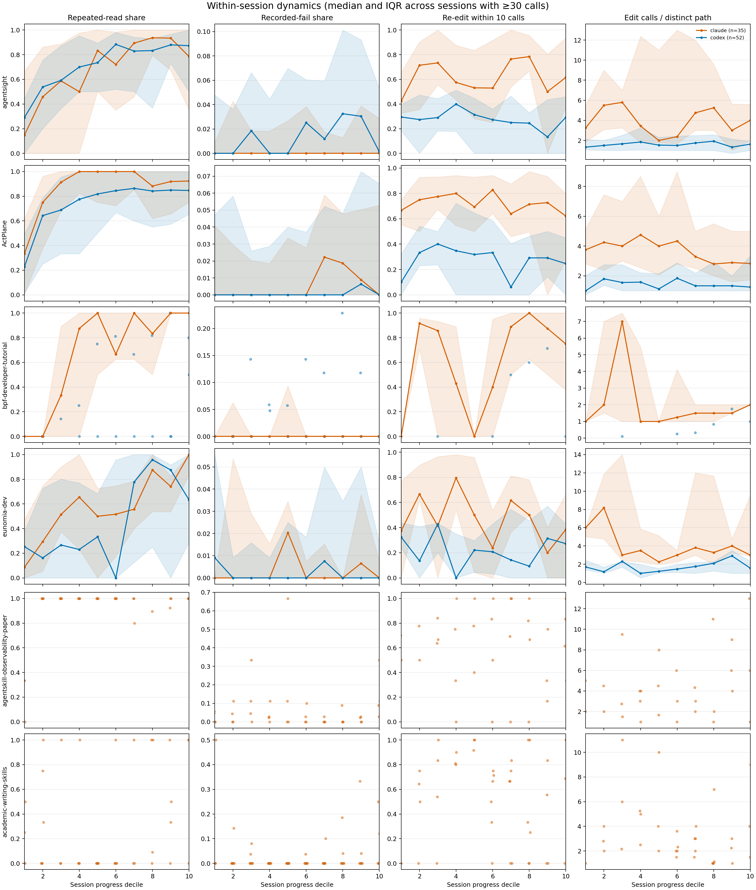
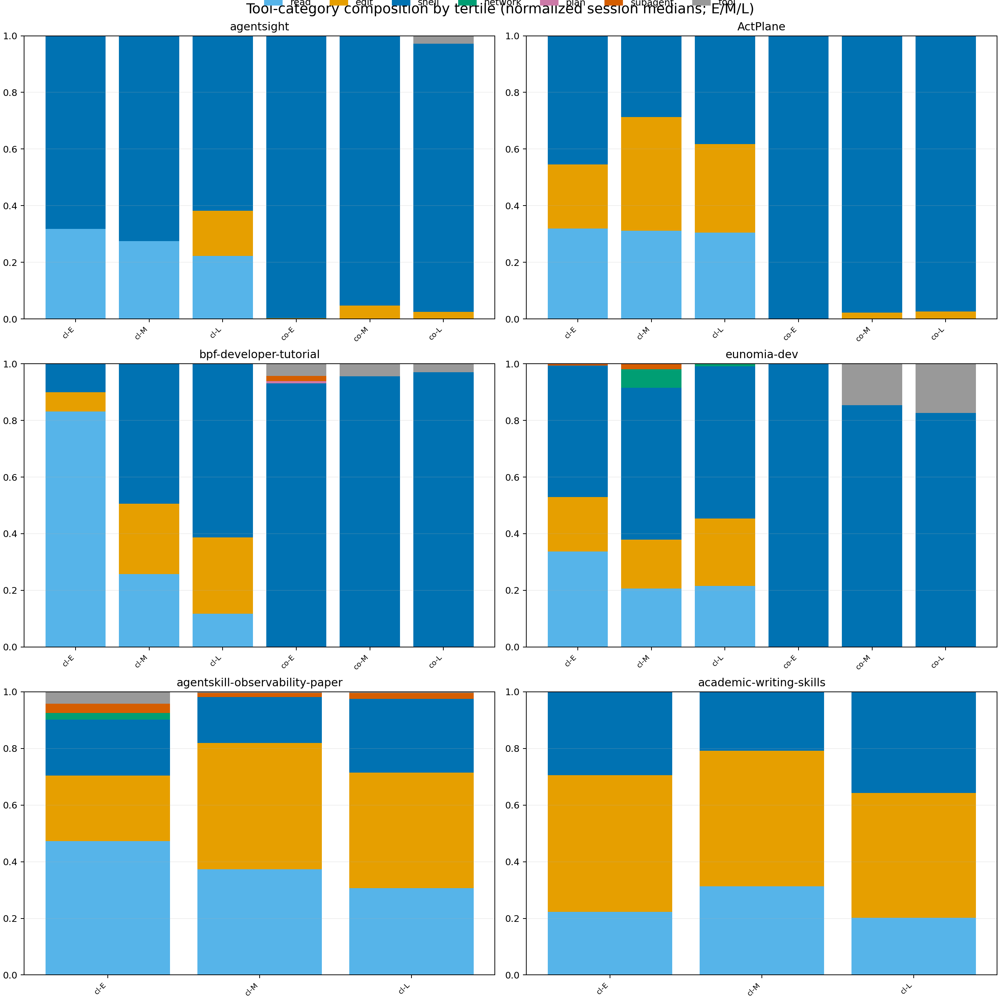
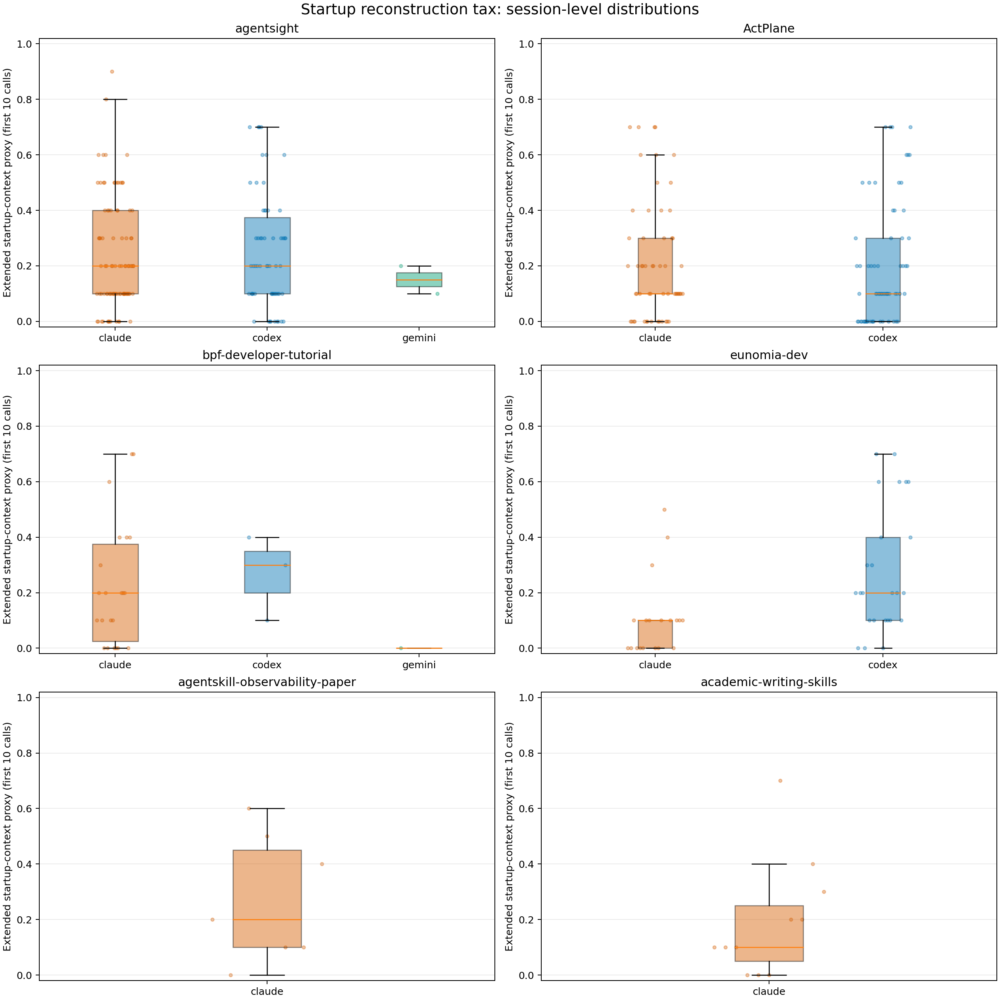
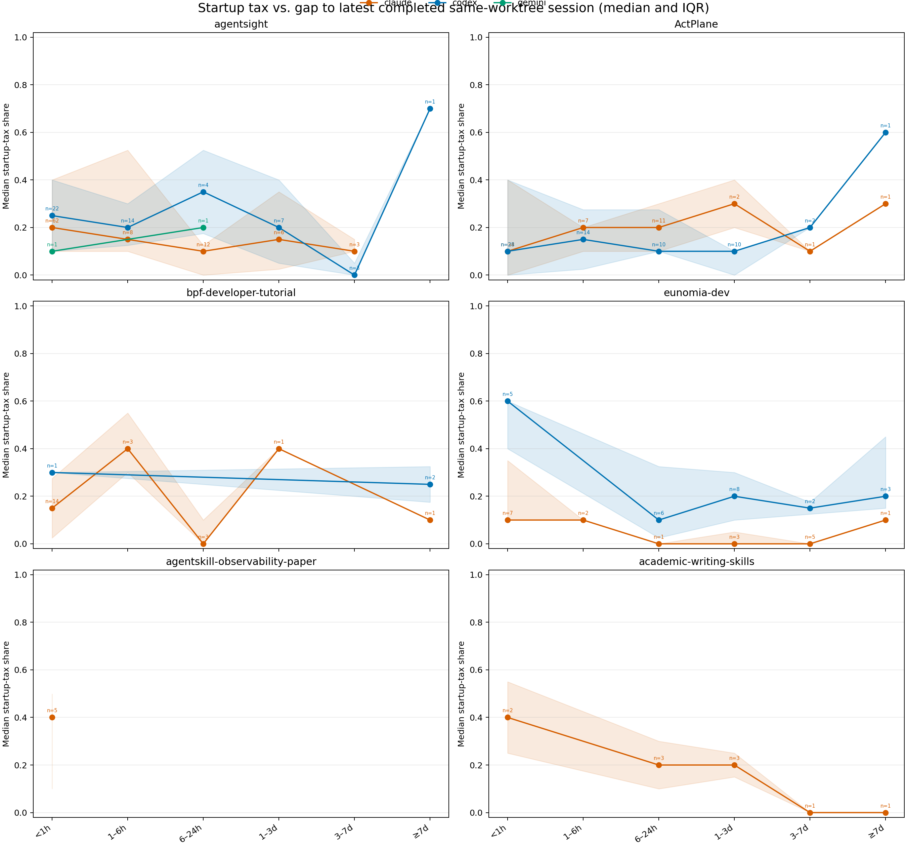
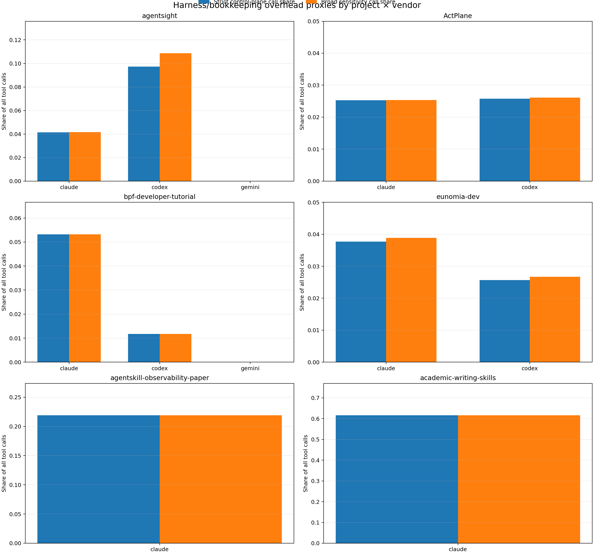
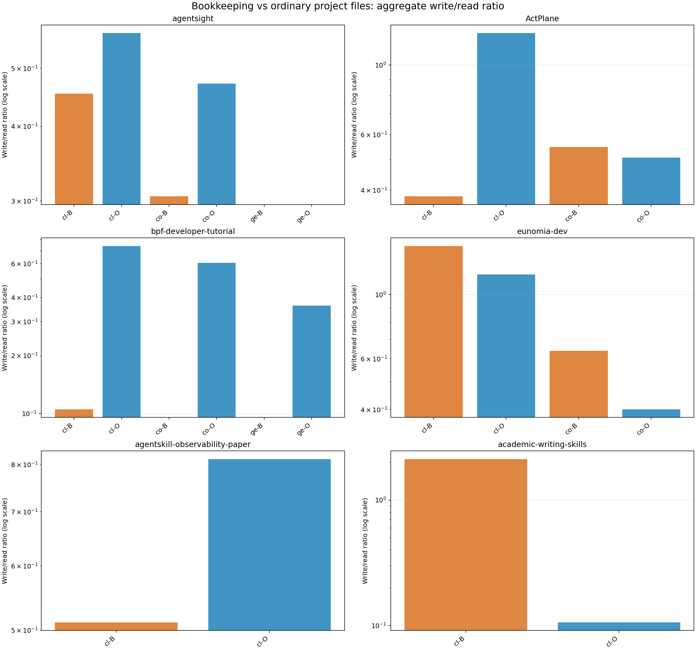
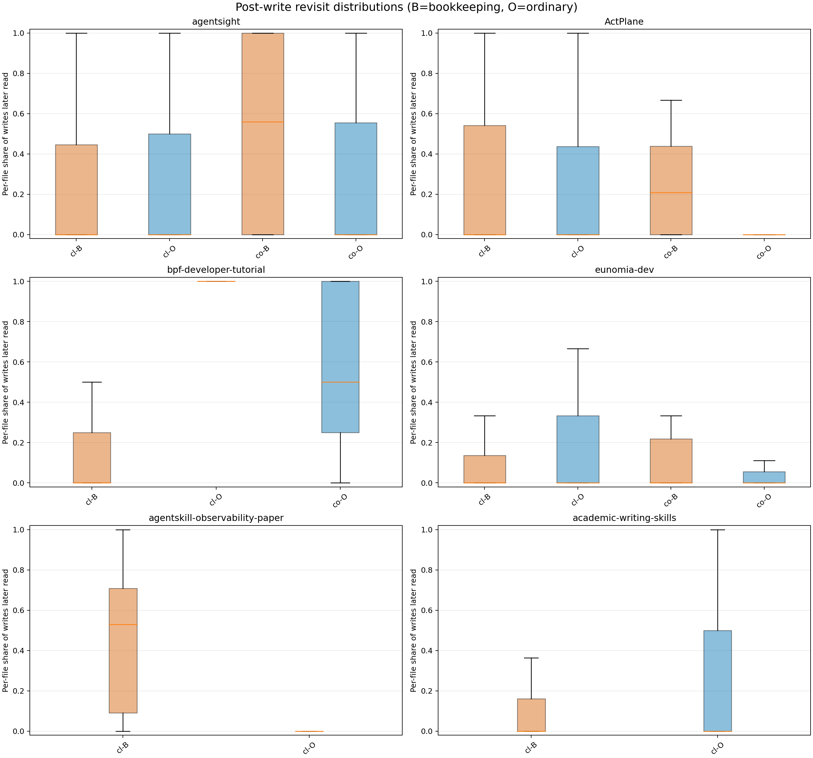
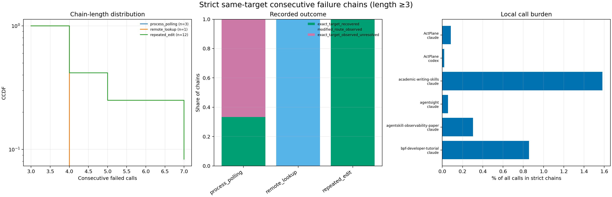

# 会话内行为演化与 Harness 开销深挖

## 摘要与口径

本报告分析六个项目的 551 个 **project-root membership**、181,303 条 project-event row、69,922 条 worktree file action。由于一个 Claude root 同时属于 AgentSight 和 ActPlane，实际是 550 个全局唯一 `session_id`、180,764 个唯一 event；项目 × vendor 统计保留双项目 membership，全局调用份额同时报告 181,303-row 主口径和 180,764-unique-event 敏感性。三 vendor 的 membership-row 调用量分别为 Codex 144,433、Claude 36,826、Gemini 44；Gemini 只有 3 个 root，始终只作稀疏描述。

所有结论都是可观察行为 proxy：重读不等于遗忘，启动上下文调用不等于浪费，harness-shaped 文件不等于反事实开销，modified route 不等于成功换路。四组分析均按项目 × vendor 输出 session/file 分布、IQR/p90、原始行与 coverage；完整 6 × 3 eligibility grid 在 [`raw/section_eligibility_full_6x3_grid.csv`](raw/section_eligibility_full_6x3_grid.csv)。

## 1. 会话内行为漂移

### 方法

每个 `(repository, session_id)` 保留 root、subagent、user 三类已 join 调用，并按 `(ts_ms, source_stream_id, source_tool_ordinal, id)` 确定性展开。所有 `L>=3` roots 都有早/中/晚三段；主要比较预先冻结为 `L>=30` 的 233 个长 root（每段至少约 10 calls），并输出 `L>=60/100`、最大内部 gap 不超过 8 小时的 non-composite sensitivity。进度曲线先在每个 session 的十个 normalized-rank bin 内计算，再对 project × vendor 的 session 分布取中位数/IQR。

重复读只用 `status != fail` 且有 `actions.artifact_id` 的 read action：若同 root 先前已读该 artifact，则计为 reread。失败同时报告 `fail/all calls` 和 `fail/(ok+fail)`；`observed` 不被改标。跨 vendor 可比的编辑碎片化 proxy 是 10-call 内同 artifact 再编辑、每 edit call 涉及的 path 数、每 unique edited path 的 edit call 数；patch line 只作为 Codex `apply_patch` coverage-limited sensitivity。

### 数字表：晚段减早段的 session-level 中位差

括号中是该 metric 在早、晚段均可定义的 session 数；`pp` 为百分点。`n<10` 仅描述，不作稳定趋势。

| Project | Vendor | long roots | Δ reread pp (n) | Δ fail pp (n) | Δ re-edit pp (n) | Δ edit calls/path (n) |
|---|---|---:|---:|---:|---:|---:|
| agentsight | claude | 35 | +17.2 (28) | +0.0 (35) | +7.9 (13) | +1.81 (12) |
| agentsight | codex | 52 | +23.1 (41) | +1.4 (52) | +1.1 (23) | +0.45 (20) |
| agentsight | gemini | 0 | N/A | N/A | N/A | N/A |
| ActPlane | claude | 40 | +16.7 (33) | +1.0 (40) | +0.0 (31) | +0.30 (29) |
| ActPlane | codex | 51 | +22.2 (42) | +0.0 (51) | +0.9 (22) | +0.12 (21) |
| bpf-developer-tutorial | claude | 10 | +83.2 (7) | +0.0 (10) | -2.2 (5) | -1.00 (5) |
| bpf-developer-tutorial | codex | 3 | +9.1 (3) | +0.0 (3) | +60.0 (1) | +1.77 (1) |
| bpf-developer-tutorial | gemini | 0 | N/A | N/A | N/A | N/A |
| eunomia.dev | claude | 10 | +19.7 (5) | -0.4 (10) | +2.2 (5) | -1.71 (4) |
| eunomia.dev | codex | 21 | +28.9 (18) | +0.0 (21) | -1.3 (6) | -0.39 (6) |
| agentskill-observability-paper | claude | 4 | +15.5 (4) | -1.6 (4) | -6.2 (4) | +7.25 (4) |
| academic-writing-skills | claude | 7 | +0.0 (5) | +0.0 (7) | -3.4 (4) | -1.64 (3) |

完整分布见 [`raw/drift_quantiles.csv`](raw/drift_quantiles.csv)、paired 差值见 [`raw/drift_paired.csv`](raw/drift_paired.csv)，长度和 composite sensitivity 见 [`raw/drift_length_sensitivity_quantiles.csv`](raw/drift_length_sensitivity_quantiles.csv) 与 [`raw/drift_paired_noncomposite_8h_quantiles.csv`](raw/drift_paired_noncomposite_8h_quantiles.csv)。

### 解读

1. 最稳定的晚期变化是 **resolved artifact reread 上升**。在 metric 至少有 10 个 paired sessions 的五个主要 strata 中，中位增量均为正，范围 +16.7 到 +28.9 pp；去掉最大内部 gap 超过 8 小时的 composite roots 后，AgentSight Claude/Codex 仍为 +19.4/+19.4 pp，ActPlane Claude/Codex 为 +23.8/+23.6 pp，eunomia Codex 为 +35.0 pp。
2. 失败没有同样的普遍漂移。多数 strata 的晚减早中位数为 0；较清楚的例外是 AgentSight Codex（+1.4 pp，52 roots），ActPlane Claude 只有 +1.0 pp，eunomia Claude 反而 -0.4 pp。
3. “编辑更碎”也不普遍成立：大样本 strata 的 10-call re-edit 中位变化大多接近 0，edit calls/path 有正有负。Codex 可解析 patch 的中位 changed lines 确有下降（如 AgentSight 19.75→14.25、ActPlane 18→10），但该指标对 Claude 不可见，不能作跨 vendor 主结论。
4. 工具组合漂移高度依赖项目与接口：bpf-developer-tutorial Claude 的 read-category share 中位下降 55.2 pp、shell 上升 46.8 pp；academic-writing-skills Claude 的 read 下降 14.7 pp、edit 上升 16.7 pp；Codex 的 resolved reads 常由 shell 承载，因此 category=`read` 不能跨 vendor 直接解释为“是否在读”。
5. 因此数据支持的是 **“晚期更依赖已见 artifact”这一局部 context-aging signature**，不支持“晚期全面退化为更多失败、原地重试和碎编辑”。这些 root 还可能跨真实对话恢复或包含并发 subagent；call-rank association 不能证明 latent context 已老化。

### 异常案例

- `bpf-developer-tutorial / claude:35ee4fce-b9a5-4af7-94c9-38a7fa4f4bea`：153 calls；reread 由早段 12.5% 升到晚段 95.7%，但 edit share 同时从 54.9% 降到 23.5%、edit calls/path 从 14 降到 6。它像从集中创作转向检查/验证，而不是单纯恶化。
- `agentsight / claude:c41e709f-5037-404a-bfbe-a29cf799515a`：1,710 calls、39 streams，晚段 edit calls/path 达 88.5（早段 6.52）；但最大内部 gap 18.47 小时，属于 non-composite sensitivity 会剔除的 resumed-root 极端值。
- `agentsight / codex:019e8713-2449-71e3-8358-d3310df82456`：39 calls、单 stream，失败率由早/中段 0 升至晚段 23.1%，但全程没有 edit call；这是失败晚聚集的真实反例，也说明失败漂移与编辑碎片化不是同一现象。

## 2. 会话启动开销

### 方法

对 `N={5,10,20}` 取前 `min(N,L)` calls，并另标 `L>=N` 的完整 prefix。**Narrow startup-context proxy** 是 exact `AGENTS.md`/`CLAUDE.md`/`GEMINI.md` read 与解析到的 `git status/log` 的非加和 union；**extended proxy** 再加入 repository-root README read、对严格前驱 root 已访问 artifact 的 resolved reread。前驱 mutation overlap 单列，避免把“上次读过”混同于“上次刚改过”。

严格前驱是同 `(repository, unique worktree_id)` 中、结束时间小于当前开始时间且结束最晚的 root；gap 是两条纳入轨迹之间的间隔，不是真实 idle time。主表使用 362 个完整 N=10 roots，其中 348 个有严格前驱；Spearman 只在 `n>=10` 的 project × focal-vendor 内计算。

### 数字表：前 10 calls 的 session 分布

| Project | Vendor | complete N=10 | predecessor | narrow median [IQR] | extended median [IQR]; p90 | gap ρ (n) |
|---|---|---:|---:|---:|---:|---:|
| agentsight | claude | 91 | 91 | 10% [0, 10] | 20% [10, 40]; 50% | -0.29 (91) |
| agentsight | codex | 58 | 51 | 10% [10, 10] | 20% [10, 38]; 60% | -0.06 (51) |
| agentsight | gemini | 2 | 2 | 0% [0, 0] | 15% [12, 18]; 19% | N/A |
| ActPlane | claude | 57 | 56 | 0% [0, 10] | 10% [10, 30]; 60% | -0.02 (56) |
| ActPlane | codex | 66 | 65 | 10% [0, 10] | 10% [0, 30]; 55% | +0.06 (65) |
| bpf-developer-tutorial | claude | 22 | 22 | 0% [0, 0] | 20% [2, 38]; 58% | -0.02 (22) |
| bpf-developer-tutorial | codex | 3 | 3 | 20% [10, 25] | 30% [20, 35]; 38% | N/A |
| bpf-developer-tutorial | gemini | 1 | 0 | 0% [0, 0] | 0% [0, 0]; 0% | N/A |
| eunomia.dev | claude | 19 | 19 | 0% [0, 10] | 10% [0, 10]; 32% | -0.76 (19) |
| eunomia.dev | codex | 25 | 24 | 10% [0, 10] | 20% [10, 40]; 60% | -0.21 (24) |
| agentskill-observability-paper | claude | 7 | 5 | 0% [0, 0] | 20% [10, 45]; 54% | N/A |
| academic-writing-skills | claude | 11 | 10 | 0% [0, 10] | 10% [5, 25]; 40% | -0.60 (10) |

### 解读

1. 跨 362 个完整 N=10 roots，narrow proxy 的中位数为 10%、IQR 0–10%；extended proxy 为 20%、IQR 10–30%、p90 60%。因此启动端存在明显右长尾，但“典型 root 前 10 calls 大半都在重建上下文”不成立。
2. Explicit instruction file read 极少：98.6% roots 的前 10 calls 没有这类 resolved read；narrow proxy 几乎全部来自 `git status/log`。README 也有 91.4% 为零；extended 的额外质量主要来自前驱 artifact reread。
3. 前驱 reread 可能是高效 continuation，而不是税：52.8% roots 为零，但 p75 已达 20%；真正重读前驱 mutation artifact 的 roots 更少，81.2% 为零、p90 为 20%。报告因此拒绝把 extended proxy 的补集直接称为“新工作”。
4. **没有发现启动 proxy 随 gap 增长而上升。** ActPlane Claude/Codex、bpf Claude、AgentSight Codex 的 ρ 在 -0.06 到 +0.06；AgentSight Claude 为 -0.29，eunomia Claude 为 -0.76。后两者是负相关而非预期的正相关，且不能跨项目汇总成因果结论。
5. N sensitivity 没有推翻量级：多数非稀疏 strata 的 N=5/10/20 extended 中位落在 5–22% 范围；随着 prefix 变长，固定数量的 git/context call 往往被稀释。

### 异常案例

- `agentsight / claude:304fbd2c-976a-4791-894f-2fa166306a4d`：距前驱仅 0.02 小时，前 10 calls 有 9 次 `git log/status`（含 `git -C <path>`），反复检查远端分支与 Overleaf ahead/behind；extended=90%，属于 repository-state 查询环，而不是长 gap 重建。
- `agentsight / claude:10d49fab-8f0a-43d8-a7e6-3e35cf5dba04`：距前驱 0.07 小时，前 10 calls 中 8 次读取前驱刚访问过的 Skill/reference 文件；extended=80%，但这些读取与当前 Skill 审查任务本身高度相关。
- `eunomia.dev / codex:019f4fd2-67db-7933-bd17-eaf0f3ff13e3`：gap 357.9 小时，extended=70%（2 次 git、5 次前驱 overlap，其中 4 次也是前驱 mutation）；这是“长 gap 高重建”的真实个案，但同 strata 的整体 ρ=-0.21，不可用个案替代分布。

完整 prefix 行与 component tags 在 [`raw/startup_sessions.csv`](raw/startup_sessions.csv) 和 [`raw/startup_details_n10.csv.gz`](raw/startup_details_n10.csv.gz)，gap bins 与相关在 [`raw/startup_gap_bins.csv`](raw/startup_gap_bins.csv)、[`raw/startup_gap_spearman.csv`](raw/startup_gap_spearman.csv)。

## 3. Harness / Skill 簿记开销

### 方法

冻结的 narrow 文件类是 instruction、memory/checkpoint、TODO/task/plan/status、Skill definition/reference、experiment/process status；broad 只额外加入更宽的 process-doc regex。`actions/artifact_id` 用于 in-worktree identity，`source_paths` 补 external Skill/memory；181,303 rows 中 60,336 有 actions、68,954 有 source paths，8,618 是 source-path-only，故不能只看 actions。

**Gross harness-shaped footprint** 是触及上述文件或显式 plan/Skill tool 的 event；**exclusive bookkeeping proxy** 要求同 event 没有普通 in-worktree target，mixed 单列。`attribution_skill` 只作 provenance。文件读写比和 revisit 只用 `status != fail` access；50-call revisit 对每次 write 只有在后续 50 calls 可观察、或已在 50 calls 内读到时才进入分母，避免把 corpus 尾部误判成“永不再读”。

### 总量

- 严格文件簿记调用 10,147 / 181,303 = **5.60%**。
- 加 1,520 个 plan calls 和 76 个显式 Skill invocations 后，gross 为 11,743 = **6.48%**；exclusive 为 10,733 = **5.92%**，mixed 为 1,010 = 0.56%。
- Broad sensitivity 为 12,756 = **7.04%**；180,764 unique-event 去重口径的 strict gross 为 **6.50%**。
- 排除 `academic-writing-skills` 中作为项目产品的 in-repo Skill artifact 后，adjusted strict gross 为 **6.26%**。

### 数字表：项目 × vendor

`book read≤50` 是 eligible bookkeeping writes 中 50 calls 内被读回的份额。Gemini 或小分母行只描述。

| Project | Vendor | calls | gross | exclusive | adjusted | book W/R | ordinary W/R | book read≤50 (n) | ordinary read≤50 (n) |
|---|---|---:|---:|---:|---:|---:|---:|---:|---:|
| ActPlane | claude | 17,994 | 2.5% | 2.5% | 2.5% | 0.38 | 1.26 | 36.9% (111) | 59.8% (4,890) |
| ActPlane | codex | 48,244 | 2.6% | 2.5% | 2.6% | 0.55 | 0.51 | 37.2% (180) | 43.6% (5,285) |
| academic-writing-skills | claude | 948 | 61.6% | 61.6% | 20.0% | 2.12 | 0.11 | 29.8% (252) | 33.3% (3) |
| agentsight | claude | 12,525 | 4.2% | 4.1% | 4.2% | 0.45 | 0.57 | 26.4% (106) | 76.8% (1,738) |
| agentsight | codex | 85,034 | 9.7% | 8.6% | 9.7% | 0.31 | 0.47 | 59.6% (2,218) | 48.1% (9,328) |
| agentsight | gemini | 27 | 0.0% | 0.0% | 0.0% | N/A | 0.00 | N/A | N/A |
| agentskill-observability-paper | claude | 991 | 21.9% | 21.9% | 21.9% | 0.51 | 0.81 | 45.8% (59) | 90.5% (179) |
| bpf-developer-tutorial | claude | 1,052 | 5.3% | 5.3% | 5.3% | 0.11 | 0.74 | 25.0% (4) | 99.4% (167) |
| bpf-developer-tutorial | codex | 595 | 1.2% | 1.2% | 1.2% | 0.00 | 0.61 | N/A | 60.6% (71) |
| bpf-developer-tutorial | gemini | 17 | 0.0% | 0.0% | 0.0% | N/A | 0.36 | N/A | N/A |
| eunomia.dev | claude | 3,316 | 3.8% | 3.7% | 3.8% | 1.47 | 1.17 | 16.0% (100) | 58.1% (475) |
| eunomia.dev | codex | 10,560 | 2.6% | 2.4% | 2.6% | 0.64 | 0.40 | 26.7% (191) | 33.3% (643) |

### 解读

1. Harness-shaped footprint 的项目 row 主口径是 6.48%，不是主导调用量，但分布极不均匀：ActPlane 约 2.5%、eunomia 2.6–3.8%，AgentSight Codex 9.7%，agentskill-observability-paper 21.9%。因此单个 pooled 百分比不足以代表所有项目。
2. `academic-writing-skills` 的 gross 61.6% 是分类边界警报：Skill 文件就是该项目的实体产品。调整后仍有 20.0%，但不能把未调整值写成 harness waste。
3. “要求写很多文档、整体几乎不回头看”的强版本 **未被支持**。全局 bookkeeping write/read=0.382，低于普通文件 0.576；598 个被写 bookkeeping file 中 31.1% 没有任何同 vendor read，而 3,432 个普通 written file 是 39.4%。bookkeeping 并不比普通文件更普遍地“写后零读”。
4. 较窄时间窗里存在更有意思的局部模式：50-call pooled revisit 是 bookkeeping 50.5% vs ordinary 52.3%，只差 1.8 pp；但在 9 个双方分母都可定义的 strata 中，8 个 bookkeeping 更低。AgentSight Claude（26.4% vs 76.8%）、agentskill paper（45.8% vs 90.5%）、eunomia Claude（16.0% vs 58.1%）差距大；AgentSight Codex 是反例（59.6% vs 48.1%），并因体量主导 pooled 值。
5. 1,815 个 `attribution_skill` calls 中只有 120 个命中 strict gross，1,695 个（93.4%）是 ordinary、non-bookkeeping calls。这直接说明“由 Skill 引导”与“在维护 Skill/harness 文档”不是同一个 estimand。

### 异常案例

- `agentsight / codex / docs/evaluation.md`：469 reads、128 writes；`docs/idea-story.md`：471 reads、47 writes。两份核心 harness/status 文档被频繁回看，是“写完几乎不看”的明确反例。
- `ActPlane / codex / docs/tmp/rq1/guardrail_trace_tuning_todo.md`：25 reads、98 writes，W/R=3.92，50-call revisit=44%。它是真实的 write-heavy TODO，但仍非零回读。
- `academic-writing-skills / claude / skills/auto-research-orchestrator/references/hierarchical-research-state-machine.md`：6 reads、68 writes，W/R=11.33；这是最强 write-heavy 例子之一，但它是项目交付物，不能作为 harness overhead 的纯例子。
- `agentsight / claude` 的 bookkeeping 首次回读距离中位 107.5 calls，普通文件仅 6 calls；这里“文档回看更慢”比“文档从不回看”更贴合证据。

逐 access 删失字段见 [`raw/bookkeeping_accesses.csv.gz`](raw/bookkeeping_accesses.csv.gz)，每文件分布见 [`raw/bookkeeping_files.csv`](raw/bookkeeping_files.csv)，规则和 top paths 见 [`raw/bookkeeping_kind_summary.csv`](raw/bookkeeping_kind_summary.csv)、[`raw/bookkeeping_top_files.csv`](raw/bookkeeping_top_files.csv)。

## 4. 失败级联与重试环

### 方法

严格 cascade 不使用并发 stream flatten 后的邻接，而是在 `(repository, session_id, source_stream_id)` 内按 `(source_tool_ordinal, ts_ms, id)` 排序。Exact target key 优先使用 `(category, sorted artifact_id/access set)`，其次 normalized source paths，最后才是 `(tool_name, command_name, whitespace-normalized exact command)`；至少 3 个立即相邻、同 key、`status=fail` 才计入。

Full-stream outcome 是机械标签：exact target 后来 `ok`、后来只有 `observed`、后来再次 `fail`、同 coarse family 的 modified route、或没有观察到返回。另给 next-10/50 outcomes；“无返回”是删失，不叫放弃。允许中间最多 2 calls 的 interleaved sensitivity 只用于 pattern discovery，不改变严格 chain 计数。

### 分布与结局

| Pattern | Chains | chain calls | length median [IQR], max | Full-stream outcome |
|---|---:|---:|---:|---|
| process_polling | 3 | 9 | 3 [3, 3], 3 | observed-unresolved: 2；exact recovered: 1 |
| remote_lookup | 1 | 3 | 3 [3, 3], 3 | modified route observed: 1 |
| repeated_edit | 12 | 46 | 3 [3, 4], 7 | exact recovered: 12 |

全体 16 条 strict chains、58 个 chain-member calls，只占 181,303 rows 的 **0.0320%**；unique-event sensitivity 为 0.0321%。链长中位 3、IQR 3–4、p90=5、最大 7。Full-stream 有 13/16 exact recovered、2/16 exact observed unresolved、1/16 modified route；next-10 calls 只有 9/16 exact recovered，3 条暂未返回、2 条 observed-unresolved、1 条又失败、1 条 modified route。到机械 outcome 的 calls-after-chain 中位 3、IQR 1.75–7.5、最大 125。

| Project | Vendor | chains | chain calls | local burden | median / max length |
|---|---|---:|---:|---:|---:|
| ActPlane | claude | 4 | 15 | 0.083% | 3.5 / 5 |
| ActPlane | codex | 3 | 9 | 0.019% | 3.0 / 3 |
| academic-writing-skills | claude | 4 | 15 | 1.582% | 3.5 / 5 |
| agentsight | claude | 1 | 7 | 0.056% | 7.0 / 7 |
| agentskill-observability-paper | claude | 1 | 3 | 0.303% | 3.0 / 3 |
| bpf-developer-tutorial | claude | 3 | 9 | 0.856% | 3.0 / 3 |

### 解读

1. Strict same-target cascade 在全局非常稀少，不能解释整体 5,185 个 recorded failures 或 181k calls 的主要成本；但在小项目内可显著，例如 academic-writing-skills 占 1.58%、bpf tutorial 占 0.86%。
2. 最典型死循环是 Claude `Edit` 对同一文件连续失败：12/16 chains、46/58 chain calls；所有 12 条最终在 full stream 对 exact target 得到 `ok`，说明多为可恢复的局部编辑摩擦，而不是最终放弃。
3. 第二类是 Codex `write_stdin` polling：3 条都在 ActPlane，长度均为 3；1 条下一次同 target `ok`，2 条只有 `observed`，反映 transport/process-status 不确定性，不能等同于任务失败。
4. 立即成本短、恢复尾部却很长：chain 本身 p90 仅 5 calls，但一例 exact recovery 要等 125 calls；next-10 与 full-stream outcome 差异说明长 root 具有更多恢复机会。
5. 允许两条中间调用的 sensitivity 有 39 clusters（20 edit、10 polling、5 other、3 remote、1 validation），说明“失败—诊断/修改—再失败”比严格连续链常见；它不满足用户指定的连续定义，故不并入 0.032% 主数。

### 典型 pattern 的真实案例

**Repeated exact-target Edit（取每个 pattern 最长且 root 不重复的 3 例）：**

- `agentsight / claude:5ba07bb3-7f75-40aa-a808-47abdf92aacc`，stream `04df6fd07086c51e`：`references.bib` 连续 7 次 Edit fail；3 calls 后 exact target recovered。
- `ActPlane / claude:3bfa6632-02db-43d0-af47-9c23f6508142`，stream `4f983659bc796a9a`：`docs/papers/sections/05-evaluation.tex` 连续 5 次 fail；2 calls 后 recovered。
- `academic-writing-skills / claude:48255634-a49f-48b5-ae0c-882112407193`，stream `ad28c3d119f71b25`：`skills/auto-research-orchestrator/SKILL.md` 连续 5 次 fail；12 calls 后 recovered，故 next-10 暂无返回、full-stream 成功。

**Repeated process polling（3 个真实 roots）：**

- `ActPlane / codex:019e80ef-6c47-7023-9a42-dc9dc4db3a04`，stream `a5ed645f7faec1be`：同 `session_id=28219` 的 `write_stdin` 连续 3 fail；下一 call exact `ok`。
- `ActPlane / codex:019ef100-c3dd-7b72-a922-001a7b0a570f`，stream `fae80b985eeb4932`：同 `session_id=97338` 连续 3 fail；下一 call只有 `observed`，结局 unresolved。
- `ActPlane / codex:019f25b6-06a7-75f1-9f96-6dc755de3a20`，stream `8d572a03bef69b6f`：同 `session_id=12868` 连续 3 fail；下一 call只有 `observed`。

另有 singleton：`academic-writing-skills / claude:65e5c20d-3b2d-4d9e-883f-fa5a25d39e41` 连续 3 次 `gh pr view 1 2>&1` 失败，随后改成 `gh pr view 1`，机械标签为 modified route observed。

逐 chain 与逐 call 证据在 [`raw/failures_chains.csv`](raw/failures_chains.csv)、[`raw/failures_chain_calls.csv`](raw/failures_chain_calls.csv)，interleaved sensitivity 在 [`raw/failures_interleaved_clusters.csv`](raw/failures_interleaved_clusters.csv)。

## 值得进论文或后续深挖的发现（排序）

1. **长会话晚期的 resolved artifact reread 增长是最稳健的新发现。** 它跨 AgentSight、ActPlane、eunomia 的较大 project × vendor strata 复现，并在排除 >8h composite roots 后保持；适合进论文，但应写成“late-session re-grounding / reuse of seen artifacts”，不能直接写成 context degradation。
2. **“上下文老化”只得到部分支持。** Reread 上升，失败率和编辑碎片化却没有同步普遍上升；这比简单的“会话越长越差”更有论文价值，也给后续受控实验一个明确假设：区分必要 re-grounding 与认知退化。
3. **启动开销有长尾但不随 gap 增长。** 前 10 calls 的 extended proxy 中位 20%、p90 60%，但各主要 strata 的 gap ρ 无正趋势，两个 strata 显著偏负；后续应按任务是否 continuation、新任务/恢复任务、前驱 artifact overlap 设计受控分层，而不是只用 wall-clock gap。
4. **Harness-shaped footprint 全局约 6.5%，但强烈集中于研究/Skill 项目。** Gross/exclusive/broad 为 6.48/5.92/7.04%，去重敏感性 6.50%；论文可报告分层 footprint，不能宣称 causal harness overhead。
5. **“文档写了几乎不看”的强怀疑被否定，但短窗口回看延迟在多数 strata 更差。** Bookkeeping 的零读 written-file 比例反而低于普通文件（31.1% vs 39.4%），pooled 50-call revisit 仅低 1.8 pp；然而 8/9 comparable strata 内 bookkeeping 更低，值得继续研究“回看时机/延迟”而不是二元“是否回看”。
6. **Skill provenance 不是簿记。** 93.4% 的 Skill-attributed calls 是 ordinary、non-bookkeeping work；这可作为 harness 归因研究的设计警示。
7. **严格失败死循环很少且主要是工具接口摩擦。** 0.032% 的全局 call burden 由 Claude exact-target Edit 和 Codex process polling 主导；后续最有价值的是分析允许 edit/diagnosis 间隔的 failure clusters，并接入原始 tool-result error text，而不是扩大 strict-chain 阈值。
8. **数据语义本身是重要方法发现。** 551 membership≠551 unique roots、181,303 rows≠独立 calls；root flatten 不能用于并发 stream 的 retry 邻接，`observed` 不能当 success/fail，Claude/Codex edit payload coverage 不可比。任何论文数字都应保留这些 guardrail。

## 可复现性与产物

- 一条命令：`python analysis.py`
- 冻结计划与三轮独立计划审查：[`plan.md`](plan.md)、[`plan-review.md`](plan-review.md)
- 独立结果复算与案例核验：[`result-review.md`](result-review.md)
- 输入 hash、revision、库版本和不变量：[`manifest.json`](manifest.json)
- 主脚本：[`analysis.py`](analysis.py)
- 全部原始派生表：[`raw/`](raw/)
- 全部 PNG：[`figures/`](figures/)

本目录之外没有写入；未改 `docs/paper/`，未执行任何 git 写操作。
