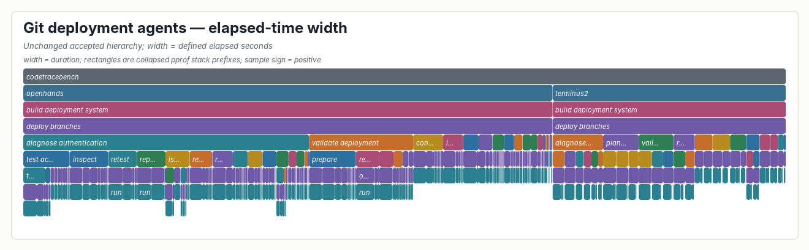
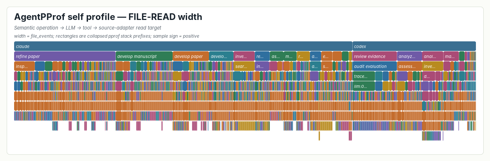
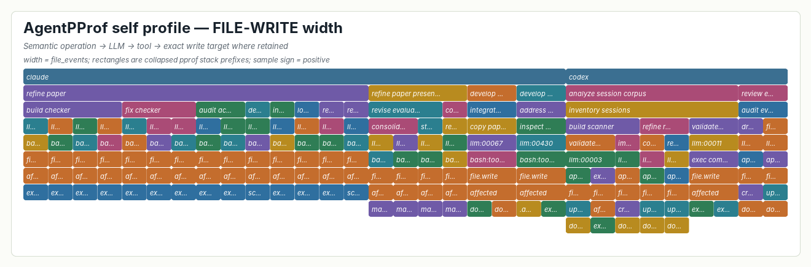
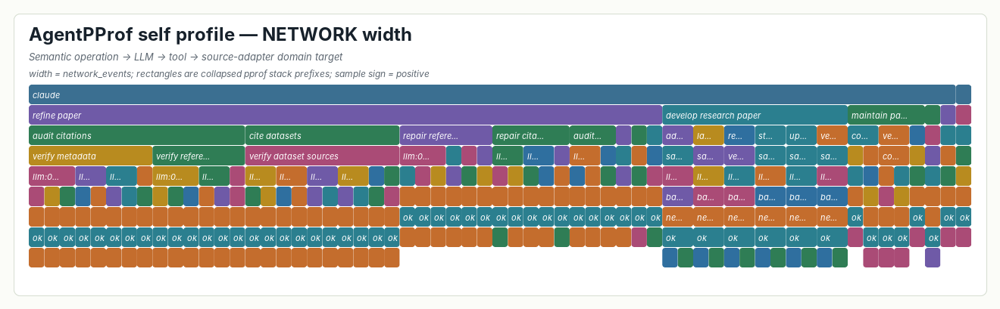
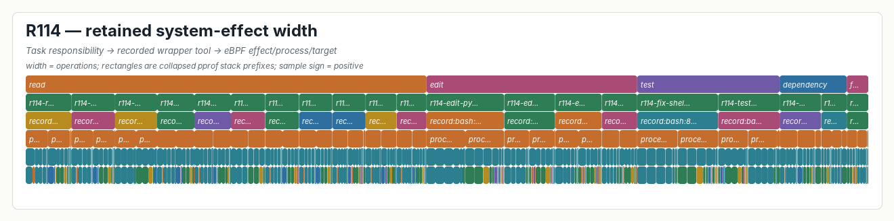

# Results: deterministic multi-measure replay

Run completed: 2026-07-27  
Status: **VALID SUPPORTING DEMONSTRATION**  
Product code changed: **no**

## Bottom line

The same accepted 489-row Git hierarchy replays under a new elapsed-time width
with zero path/evidence changes and exact conservation of the defined integer
measure. The shared `diagnose authentication` subtree accounts for 37.47% of
defined elapsed seconds, between its 21.47% operation-count share and 46.15%
token share.

The Step-0086 self-profile separately replays semantic operation stacks under
FILE-READ, FILE-WRITE, and NETWORK target-reference widths. It preserves the
parent LLM and tool evidence and exposes two exact, successful created-file
targets below the operations that created them.

The R114 fallback supplies the real system-effect chain at its retained
granularity: task responsibility -> one recorded outer Codex wrapper tool ->
eBPF process/file effects. It does not retain inner LLM IDs, file-read/network
effects, or exact file basenames. No available population supports a
network-failure correlation, so none is claimed.

## Conservation and load checks

All profiles were produced twice with the current unchanged
`agentpprof 0.2.37` release binary. Each pair is byte-identical. Every profile
loads in stock `go tool pprof`, the R221 renderer reads it through stock pprof,
and all three totals agree exactly.

| Profile | Input rows | Defined input mass | Producer | Stock pprof | Rendered | Delta |
|---|---:|---:|---:|---:|---:|---:|
| Git elapsed time | 489 | 3,982 s | 3,982 s | 3,982 s | 3,982 s | 0 |
| FILE-READ targets | 737 | 737 | 737 | 737 | 737 | 0 |
| FILE-WRITE targets | 31 | 31 | 31 | 31 | 31 | 0 |
| NETWORK/domain targets | 61 | 61 | 61 | 61 | 61 | 0 |
| R114 system effects | 1,520 | 1,520 | 1,520 | 1,520 | 1,520 | 0 |

Deterministic profile digests:

| Profile | SHA-256 |
|---|---|
| Git time | `4d94740c69fd74a3f78f876730c8d48e90a3d46546bb92ae809972e9c1de2c8f` |
| FILE-READ | `173337801f40687a995f4ed1582e5a5caf2d68bf8957b000db46422834aa93c3` |
| FILE-WRITE | `461b6b0748033e097ed21a9919eb5b267a258594a2a62274c7f599871b367c61` |
| NETWORK | `b5b727d6a2ce359a25be9ac88b58bf33a01b7f7fae9a73acdce4d80f8eebbcac` |
| R114 effects | `a0c1f79591a20cb1094f0519307a5067a3bd5dd215363b745017b57a74cef671` |

Machine-readable checks are in `profile-checks.json`; full pprof
`-top`/`-traces` reads and producer stdout are retained beside each profile.

## Frozen Git hierarchy under elapsed-time width

The time adapter mapped all 489 fixed evidence rows:

- 119/119 OpenHands/Claude calls to retained ISO action timestamps;
- 95/95 OpenHands/DeepSeek calls to retained ISO action timestamps; and
- 275/275 Terminus2 rows to the exact normalized asciinema sequence.

For Terminus2, the complete nonblank `commands.txt` sequence equals the
complete cast input sequence after excluding the initial `clear`. Literal
`C-c` maps to input byte `0x03`. The one blank command uses the next retained
input timestamp.

The adapter independently expanded the fixed sparse marks and compared the
ordered evidence-ID -> full operation-path mapping with all 489 frozen
workspace tool paths:

| Hierarchy check | Result |
|---|---:|
| Fixed evidence rows | 489 |
| Expanded accepted paths | 489 |
| Frozen workspace paths | 489 |
| Missing/extra evidence | 0 / 0 |
| Path mismatches | 0 |
| Ordered mapping SHA-256 | `ff290b2aed20ce2057241c151ed7c47a10d078c754dcd7026c8d509990d007f3` |

Thus the hierarchy, boundaries, names, evidence membership, factual fields,
and evidence order are unchanged; only additive values differ.

### Width comparison for the shared responsibility

All values are cumulative subtree mass over the same fixed 105 evidence rows.

| Width | Complete task family | `diagnose authentication` | Share |
|---|---:|---:|---:|
| Operation count | 489 | 105 | 21.47% |
| Provider-reported tokens | 4,558,192 | 2,103,587 | 46.15% |
| Defined elapsed seconds | 3,982 s | 1,492 s | 37.47% |

Elapsed mass inside the responsibility is 442 seconds in the
OpenHands/Claude run and 1,050 seconds in the OpenHands/DeepSeek run. Terminus2
does not enter the shared `diagnose authentication` path.



### Time-measure boundary

The exact profile definition is:

```text
max(1, floor(next operation start - current operation start)) seconds
terminal operation = 1 second
```

This is product-compatible elapsed attribution, not active CPU time and not
exact continuous wall duration. Across the three runs:

- raw observed inter-start gaps sum to 3,983.640 seconds;
- flooring those gaps yields 3,805 seconds;
- the one-second minimum raises 174 subsecond/zero intervals by 174 seconds;
- three terminal samples add three seconds; and
- the final conserved integer measure is 3,982 seconds.

Four samples have explicit imputation provenance: three terminal samples plus
the one Terminus2 blank-command sample. The near equality between raw gap mass
and the final measure is coincidental; rounding and minimum adjustments must
not be interpreted as exact wall-time conservation.

## FILE-READ and FILE-WRITE widths

The Step-0086 trace contains 798 read-classified tool events and 43
write-classified tool events. The target-reference profiles retain only rows
with a materializable target, yielding:

| Width | Source tools with targets | Target references | Claude | Codex |
|---|---:|---:|---:|---:|
| FILE-READ | 549 | 737 | 540 | 197 |
| FILE-WRITE | 28 | 31 | 22 | 9 |

The width is a target-reference count, so one tool may contribute more than
one target. These are source-adapter classifications, not kernel file events.
Shell path inference is coarse for some rows; the profile retains that
provenance instead of upgrading it to eBPF evidence.





### Created-files drilldown

Only successful retained `apply_patch` `Add File` headers are called
“created.” The two exact created targets are:

1. `review evidence -> audit evaluation -> draft report`
   -> `llm:00005`
   -> `apply_patch:tool:00044`
   -> `file.write / created`
   -> `docs/tmp/review/codex-eval-review-20260725T193000-0700/eval-review.md`
2. `analyze session corpus -> inventory sessions -> build scanner -> implement scanner`
   -> `llm:00003`
   -> `apply_patch:tool:00018`
   -> `file.write / created`
   -> `docs/tmp/build-and-evaluate/step-0084-20260725T193000-0700/experiment-001/inventory.py`

The FILE-WRITE profile also keeps four exact `updated` patch targets and 25
coarser `affected` targets. Update, move, delete, and affected dispositions are
not mislabeled as creation. No target absent from the retained, potentially
truncated `arguments_preview` is inferred.

A concrete FILE-READ chain is:

```text
develop paper
  -> review paper
    -> llm:00027
      -> Bash:tool:00015
        -> file.read / read
          -> docs/agentpprof-paper/main.tex
```

## NETWORK width and failure correlation

The Step-0086 source population contains 55 network-classified tool events and
61 domain-target references:

| Target | References |
|---|---:|
| `arxiv.org` | 37 |
| `unknown` | 8 |
| `anthropic.com` | 6 |
| `claude.ai` | 6 |
| `dl.acm.org` | 2 |
| `docs.langchain.co.` | 1 |
| `openreview.net` | 1 |

All 55 source network tools have status `ok`. A worked chain is:

```text
review paper
  -> review evidence
    -> research related work
      -> llm:00052
        -> WebFetch:tool:00042
          -> network.connect / ok
            -> docs.langchain.co.
```



This width counts retained source-tool/domain references, not kernel socket
connections. A network-failure cause correlation is **not materializable**:

- Step-0086 has no failed network-classified tool;
- R114 retains zero network effects; and
- the Git case has no eBPF recording.

The Git agents' SSH/curl command text is deliberately not substituted for
system network events.

## R114 real system-effect fallback

R114 provides the real eBPF path, but only at its retained granularity:

```text
known task category
  -> known task ID
    -> recorded outer Codex wrapper-tool ID
      -> system effect
        -> process
          -> retained target group
```

All 1,520 retained rows join to exactly one of 20 distinct wrapper-tool IDs and
conserve exactly:

| R114 effect | Rows |
|---|---:|
| `process.exec` | 745 |
| `process.exit` | 740 |
| `file.write` | 35 |
| file read | 0 |
| network | 0 |



For the failing responsibility `failure -> r114-failure-retry`, the retained
chain is:

```text
failure
  -> r114-failure-retry
    -> record:bash:845810:1784035169411:agent-run
      -> 18 process.exec + 19 process.exit + 2 file.write leaves
```

The expected `python3 missing_file.py` event is not among the persisted
profile rows, and R114 reports one false negative for this task. Therefore the
specific failure cause cannot be correlated to a retained system event. The
profile proves the retained task/tool/effect chain, not the missing inner
failure event.

R114 also lacks individual inner LLM IDs and exact file basenames; its
file-write targets are coarse groups. This is not combined with Step-0086 into
a fictional single stronger lineage chain.

## Amendment completion

| Binding item | Disposition |
|---|---|
| Separate FILE-READ and FILE-WRITE | complete: two conserved profiles |
| Show which operation created which files | complete for two successful retained `Add File` headers |
| Network width | complete at source-tool/domain-reference granularity |
| Network failure correlation | unavailable in all retained populations; no proxy substituted |
| Complete semantic -> LLM/tool -> effect leaves | partially materialized: complete for Step-0086 source-adapter targets, inconclusive for one semantic-to-kernel chain |
| Real system-effect example | complete at R114's retained task -> outer tool -> effect granularity |
| Add system stack to Git case only if own recording exists | not added; no Git eBPF recording exists |

The complete-chain amendment is satisfied only at the maximum retained
granularity in each provenance-separated population. Its strongest possible
single chain—semantic operation -> inner LLM/tool -> exact kernel file/network
leaf—is **partially materializable/inconclusive** because no one population
contains all those join keys. The two demonstrations above are not merged.

## Scientific disposition

The result supports the narrow RQ1 claim that one semantic hierarchy can
attribute multiple additive measures while preserving evidence, and it adds a
real system-effect fallback at coarser retained lineage. It does not establish
that all local sessions carry eBPF effects, that elapsed attribution is CPU
time, or that network failures are diagnosable from these populations.

Paper decision: **expected/supporting** for measure replay; **inconclusive/not
materializable** for exact inner-LLM-to-kernel lineage and network-failure
correlation. No thesis, RQ meaning, or scientific story change is warranted.

## Artifacts

The five primary `.pb.gz` profiles, their normalized inputs, stock-pprof
reads, producer records, deterministic second productions, local PNGs,
machine-readable checks, plan/review/preflight records, and execution log are
all in this directory.

The required R221-style PNGs are also installed under:

`docs/visexp/out/r221-pprof-renderer-v1/`

No Rust/product source was changed. Seven experiment-adapter tests pass.
