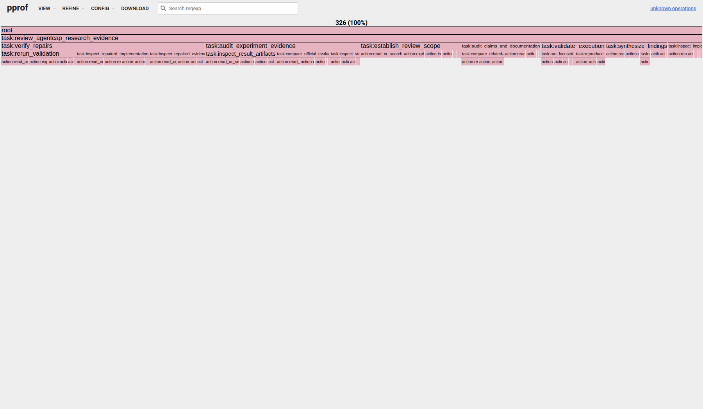

# Query-conditioned aggregation of AgentCap review sessions

This prototype combines four complete, real Codex sessions that reviewed
AgentCap research changes. It uses one shared user-facing task root and sparse
task-boundary annotations; trace identity remains a pprof label instead of a
stack frame.

The resulting operation-count profile contains 326 operations: R024 (80), R025
(75), R035 (76), and R081 (95). Its task hierarchy is variable depth. Of the
326 operations, 104 have a two-frame task path and 222 have a three-frame task
path before the action leaf.

The main recurring responsibilities are repair verification (95 operations),
experiment-evidence auditing (72), review-scope establishment (47),
claim/document auditing (37), execution validation (30), and finding synthesis
(29). Each is aggregated from at least two independent sessions; the run names
do not partition the stack.

Open
[`agentcap-review-operations.pb.gz`](out/agentcap-query-aggregation-v1/agentcap-review-operations.pb.gz)
with `go tool pprof` to filter by `source_session` or inspect evidence IDs. The
PNG above is a screenshot of Go pprof's own flame-graph view, not an AgentPProf
renderer.

This is a product-shape case study. The bounded vocabulary and transition
positions were selected from visible trajectories, so the run does not report
automatic semantic-tag accuracy.
