# AgentFlame Visual Gallery R221

Generated: `2026-06-16T07:11:27+00:00`

This gallery is generated from existing visexp artifacts. It does not read raw agent traces, call an LLM, or update the display map.

## Figures

### 01 Semantic Flamegraph

- File: [`01-semantic-flamegraph-top200.svg`](01-semantic-flamegraph-top200.svg)
- Source: R170 top-semantic-stacks-r170.csv
- What it shows: A true collapsed stack view: width is system-effect weight, not just duration spans.

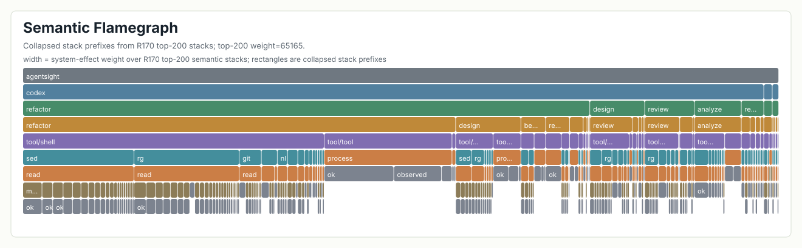

### 02 Interactive Semantic Flamegraph

- File: [`02-semantic-flamegraph-top200.html`](02-semantic-flamegraph-top200.html)
- Source: R170 top-semantic-stacks-r170.csv
- What it shows: Same flamegraph with search, hover, and click details.

### 03 Semantic Stack Treemap

- File: [`03-semantic-treemap-top200.svg`](03-semantic-treemap-top200.svg)
- Source: R170 top-semantic-stacks-r170.csv
- What it shows: Dominant session/prompt/process regions in the collapsed stack tree.

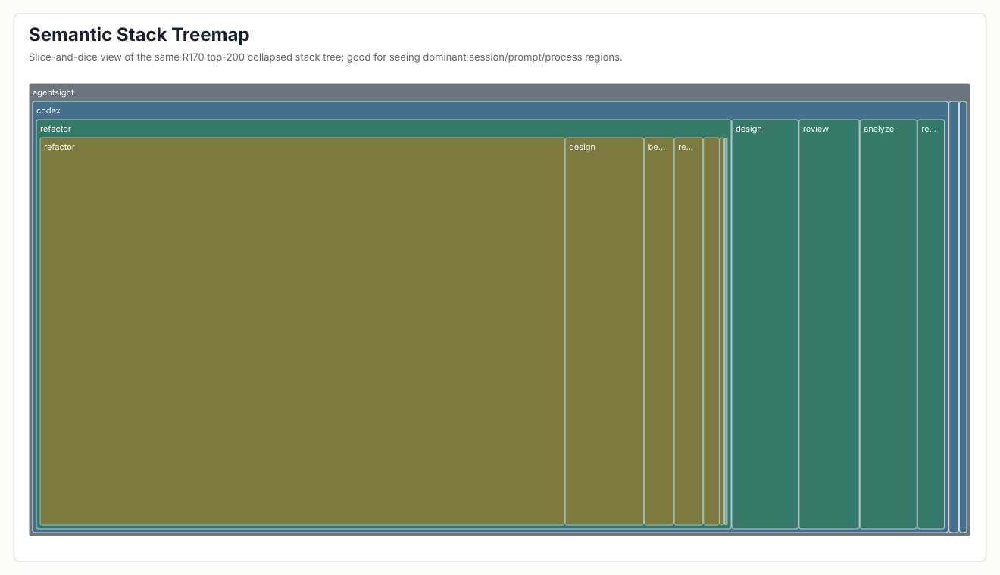

### 04 Process x Prompt Heatmap

- File: [`04-process-prompt-heatmap.svg`](04-process-prompt-heatmap.svg)
- Source: R211 process-splits-r211.csv
- What it shows: Why process-only views hide intent: same process names spread across many prompt tags.

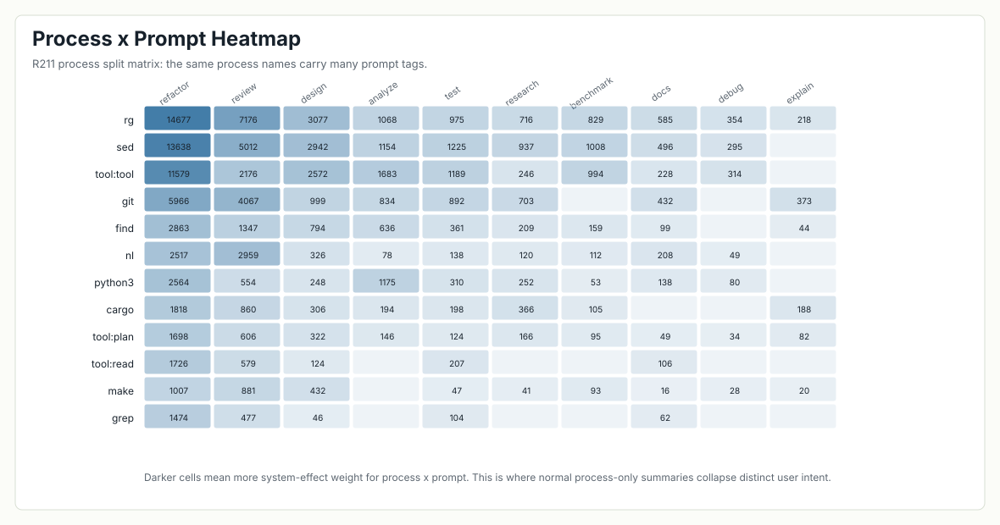

### 05 Baseline Collapse Ambiguity

- File: [`05-baseline-collapse-ambiguity.svg`](05-baseline-collapse-ambiguity.svg)
- Source: R211 baseline-collapse-examples-r211.csv
- What it shows: Concrete buckets where ordinary process/effect grouping mixes many semantic tasks.

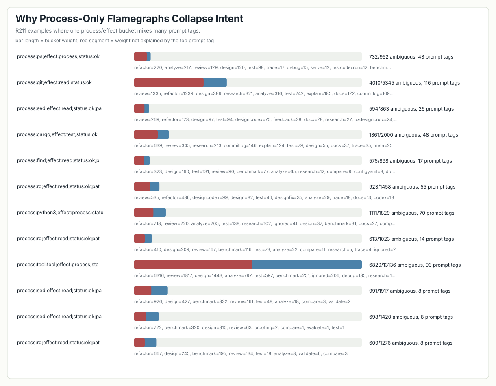

### 06 Tag Distribution Small Multiples

- File: [`06-tag-distribution-small-multiples.svg`](06-tag-distribution-small-multiples.svg)
- Source: R211 tag-distribution-r211.csv
- What it shows: Head tags and skew across session, prompt, and LLM-call dimensions.

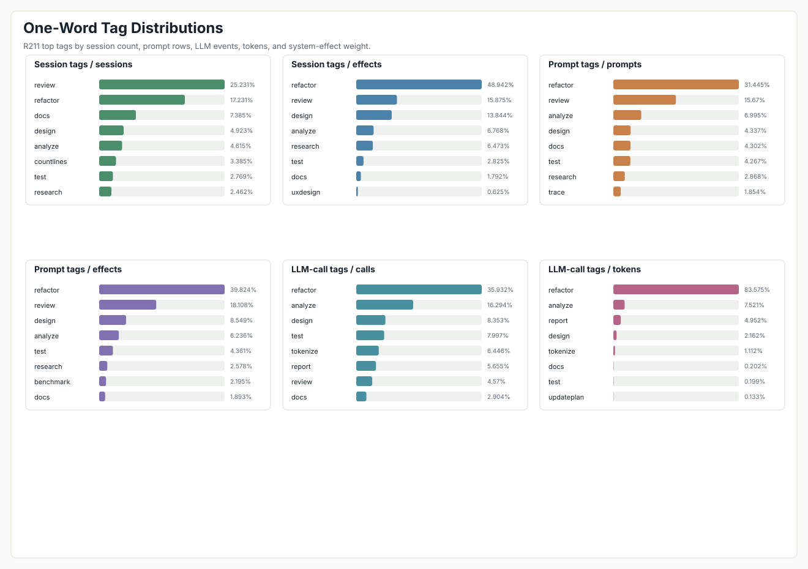

### 07 Tag Long-Tail Zipf

- File: [`07-tag-long-tail-zipf.svg`](07-tag-long-tail-zipf.svg)
- Source: R211 tag-distribution-r211.csv
- What it shows: Log-log long-tail curves that motivate reversible compaction.

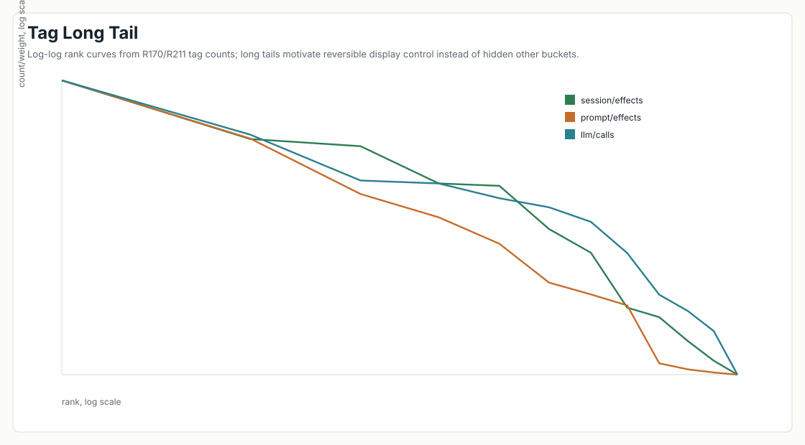

### 08 Long-Tail Rollup

- File: [`08-long-tail-rollup.svg`](08-long-tail-rollup.svg)
- Source: R214 rollup-preview-r214.csv
- What it shows: Seven governance buckets partition all raw-tag rows and support.

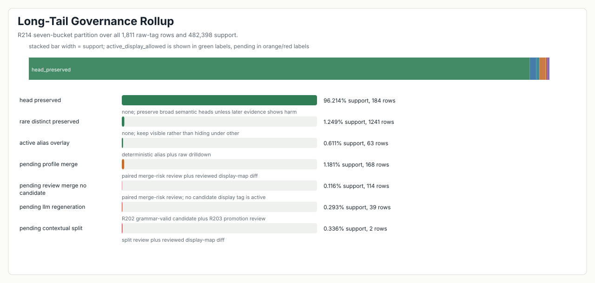

### 09 Long-Tail Control Gates

- File: [`09-long-tail-control-gates.svg`](09-long-tail-control-gates.svg)
- Source: R214 trigger-gates-r214.csv
- What it shows: Which compaction thresholds pass and which force review.

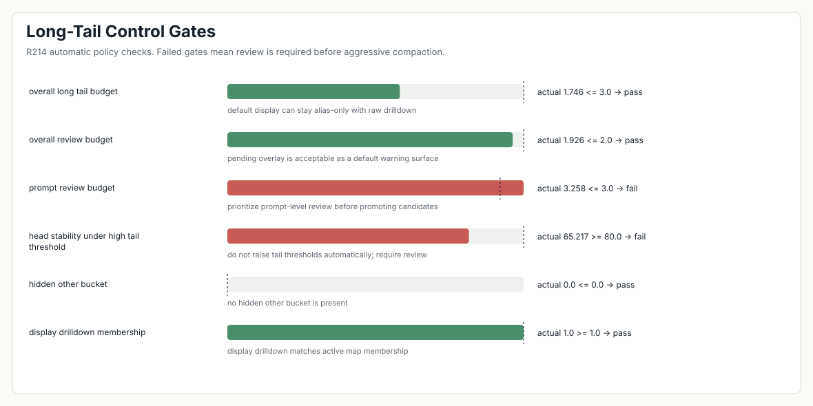

### 10 Review Priority Lane

- File: [`10-review-priority-lane.svg`](10-review-priority-lane.svg)
- Source: R214 review-priority-r214.csv
- What it shows: Highest-support pending candidate merges/regenerations.

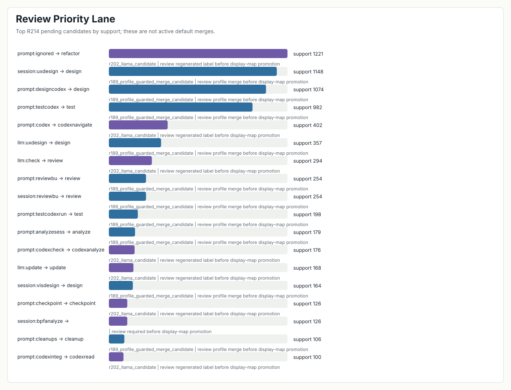

### 11 Display Mode Comparison

- File: [`11-display-mode-comparison.svg`](11-display-mode-comparison.svg)
- Source: R213 mode-summary-r213.csv
- What it shows: Raw/display/pending mode membership preservation and overlay load.

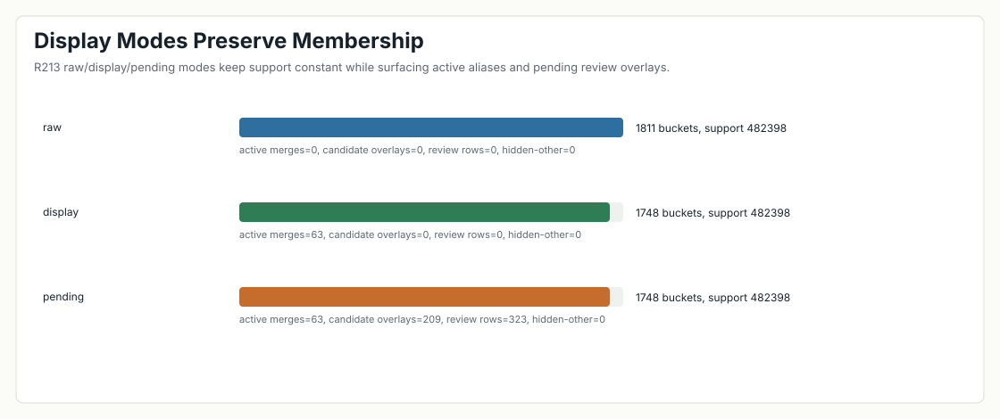

### 12 Display Compaction Ablation

- File: [`12-display-compaction-ablation.svg`](12-display-compaction-ablation.svg)
- Source: R212 variant-summary-r212.csv
- What it shows: Why unreviewed profile-guarded merges remain inactive.

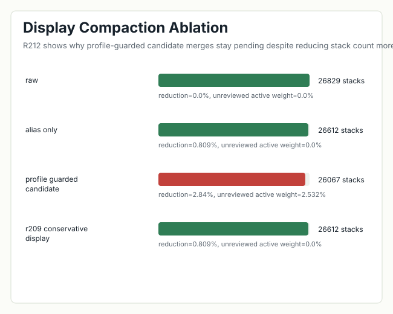

### 13 Claim Readiness

- File: [`13-claim-readiness.svg`](13-claim-readiness.svg)
- Source: R219 claim-readiness-r219.csv
- What it shows: Current research evidence level and remaining human-evidence blockers.

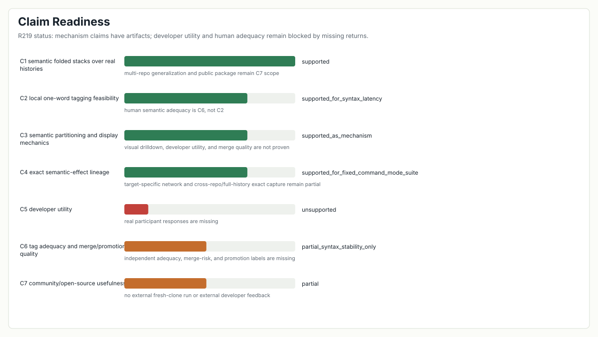

### 14 Lineage Evidence

- File: [`14-lineage-evidence.svg`](14-lineage-evidence.svg)
- Source: R114 live-record analysis and R182 network record suite
- What it shows: Exact lineage strength plus the remaining target-network gap.

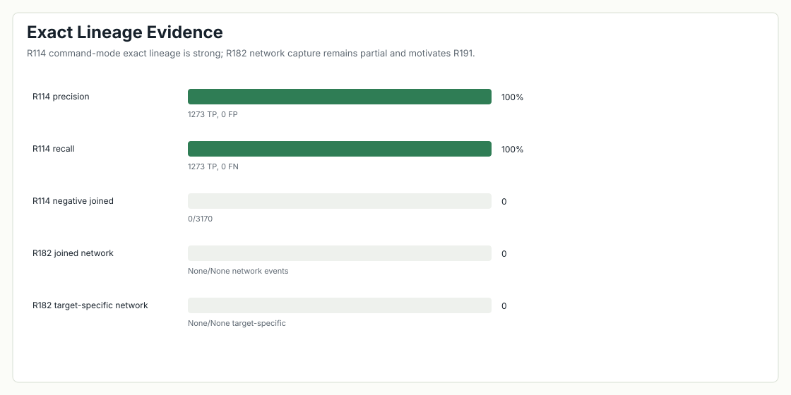

### 15 Small-Model Benchmark

- File: [`15-small-model-benchmark.svg`](15-small-model-benchmark.svg)
- Source: R180 model-benchmarks-r180.json
- What it shows: Local 0.6B/1.1B/3B one-word tag latency, validity, and stability.

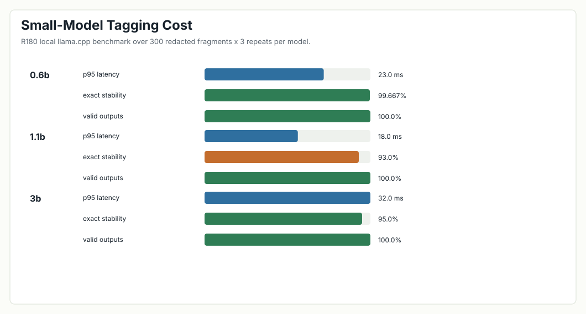

### 16 AgentFlame System Model

- File: [`16-agentflame-system-model.svg`](16-agentflame-system-model.svg)
- Source: Design summary from current artifacts
- What it shows: The intended stack schema and display-control model.

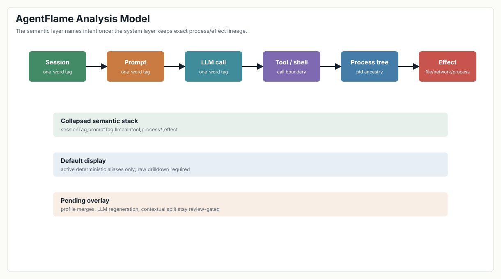
