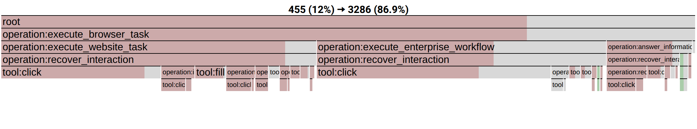
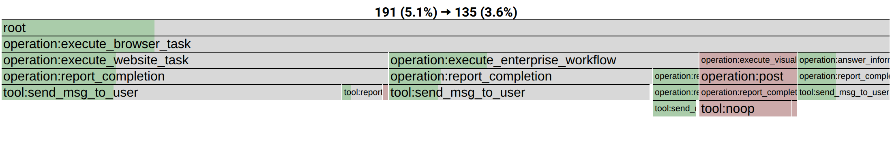

# AgentRewardBench collection differential pprof

## User Story

An agent-platform engineer knows that some web-agent runs succeed and others
fail, but a flat tool histogram only says that failed runs click, scroll, and
retry more. The engineer needs to answer a more actionable question across the
whole release population: **which shared responsibilities accumulate on the
failed side, which appear on the successful side, and which concrete calls
should be inspected first?**

Selecting one dramatic trace pair would not answer that question. This case
therefore retains every task with both outcomes, pairs every available bad run
with every available good run for that task, and folds the resulting 338 pair
occurrences into one signed pprof. The operation hierarchy is constructed
without outcomes. Only afterward does the evaluator assign bad runs positive
weight and good runs negative weight.

The primary Case Study 2 artifact is
`agentreward-338-pairs-recursive-bad-minus-good.operations.pb.gz`. It
aggregates every bad--good pair in the complete population: 440 real
trajectories across 125 mixed-outcome tasks, forming 338 pair occurrences.
Bad/candidate observations are positive; good/base observations are negative
and carry `pprof::base=true`. Stock pprof combines those observations into
net bad-minus-good differences while retaining their shared width. This
collection profile, not one selected pair, is the case study. Its stack
contains the automatic Agent's recursive operations followed by source
LLM-call and tool-call leaves. Labels retain source session and step identity
for stock-tool drilldown.

## What The Engineer Learns

The profile contains 7,366 bad-side and 3,780 good-side occurrences. The shared
`recover interaction` subtree contains 3,286 bad-side occurrences (44.6%) but
455 good-side occurrences (12.0%). Conversely, `report completion` contains
135 bad-side occurrences (1.8%) and 191 good-side occurrences (5.1%). The
recovery panel further separates the contributing model, task family, retry
operation, LLM call, and tool leaf. The engineer can therefore start with the
widest recovery branches and use pprof labels to open the exact sessions,
instead of reading 440 traces in order.

This is useful evidence, not a causal claim. Longer failed runs can contribute
more occurrences, and the profile does not prove that removing one recovery
branch will make the task succeed. The independent expert-looping analysis
below checks the narrower claim that the visible recovery exposure corresponds
to a real annotated problem.

```bash
go tool pprof -top \
  agentreward-338-pairs-recursive-bad-minus-good.operations.pb.gz
go tool pprof -top \
  -focus='recover_interaction' \
  agentreward-338-pairs-recursive-bad-minus-good.operations.pb.gz
go tool pprof -top \
  -focus='report_completion' \
  agentreward-338-pairs-recursive-bad-minus-good.operations.pb.gz
```

The automatic backend was outcome-blind. Only after all 440 trajectories were
annotated and independently audited did the evaluator open the task outcomes
and the independent expert `trajectory_looping` endpoint. The canonical
recovery-path score has AP 0.633688 versus prevalence 0.397701; its
10,000-draw task-cluster interval over prevalence is
`[+0.181425, +0.292742]`. The corresponding fixed-chain baseline has AP
0.655962, and the recursive-minus-fixed interval
`[-0.107033, +0.061116]` does not establish incremental superiority. The
result supports correspondence to a real problem, not universal dominance.

The compact shared identities also make the collection view readable:
`execute browser task` scopes each session, benchmark-level work folds under
`execute website task`, `execute enterprise workflow`, `execute visual task`,
or `answer information request`, and the two diagnostic focuses are
`recover interaction` and `report completion`. All names are one to three
meaningful words; source call IDs and tools remain below them in the pprof.

`agentreward-440-trajectories-recursive.operations.pb.gz` is the unsigned
population profile. It contains 7,229 operation samples and has observed
semantic depth four before the LLM-call and tool-call evidence leaves. The
workspace that generated it is `recursive-annotation-v1/`.

The earlier fixed-chain profile
`agentreward-338-pairs-bad-minus-good.operations.pb.gz` is retained as the
registered comparison, not as the primary recursive case figure. The two
VisualWebArena-512 files are retained only as source-evidence drilldowns for
one path found in the aggregate collection; they are not standalone case
studies.

```bash
go tool pprof -top visualwebarena-512-bad-minus-good.operations.pb.gz
go tool pprof -top visualwebarena-512-bad-minus-good.tokens.pb.gz
go tool pprof -top -focus='error|repeated|stopped' \
  visualwebarena-512-bad-minus-good.tokens.pb.gz
go tool pprof -top -focus='conclusion' \
  visualwebarena-512-bad-minus-good.tokens.pb.gz
```

The current paper views are stock-pprof differential flamegraphs:





In each box, the full width is good/base plus bad/candidate, the rose or green
inset is the signed net difference, and gray is the overlapping remainder.
The arrow reports good to bad. The views are exported directly from stock
`go tool pprof`; the repository script only automates the headless browser
capture:

```bash
python3 ../../../../script/render_pprof_diff_flamegraph.py \
  --profile agentreward-338-pairs-recursive-bad-minus-good.operations.pb.gz \
  --focus recover_interaction \
  --hide 'agent:|call_id:' \
  --output ../../../paper/figures/agentreward-recovery-differential.operations.pdf

python3 ../../../../script/render_pprof_diff_flamegraph.py \
  --profile agentreward-338-pairs-recursive-bad-minus-good.operations.pb.gz \
  --focus report_completion \
  --hide 'agent:|call_id:' \
  --output ../../../paper/figures/agentreward-completion-differential.operations.pdf
```

The PDFs are vector paper derivatives; PNG copies support Markdown preview.
Neither is an additional AgentPProf product output. AgentPProf still emits only
the standard `.pb` or `.pb.gz` profile, which any pprof-compatible viewer can
open for interactive drilldown.
