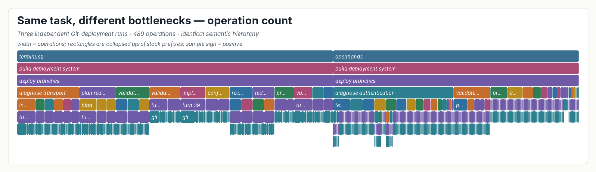
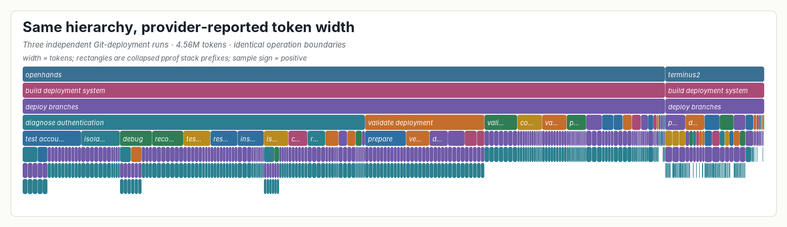
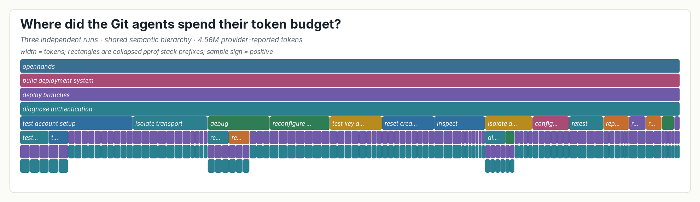

# Case Study: Why the Git Deployment Agents Kept Failing at SSH

## User Question

Three independent long-horizon agents received the same deployment task: host a
Git repository at `git@localhost:/git/project`, accept a fixed password, deploy
`main` and `dev` through a post-receive hook, and serve both branches over
HTTPS. The useful profiling questions are not merely which tools ran. They are:

- how did each agent decompose the task;
- where did it return to the same unresolved responsibility;
- which paths dominated operation count versus token consumption;
- did an expensive diagnostic path reach the requested terminal condition;
- which concrete LLM and tool calls support each aggregate operation.

## Population And Workspace

The surrounding long-horizon population contains 41 real agent sessions,
3,146 source-native turns, and 5,750 operations. This focused workspace retains
all three executions of the repeated `git-multibranch` task:

- OpenHands with Claude Sonnet 4 Thinking;
- OpenHands with DeepSeek V3.2;
- Terminus2 with DeepSeek V3.2.

The source adapter materializes 735 ordered source nodes. The final automatic
Agent annotation contains 96 boundaries over those nodes. Its operation names
use reusable one-to-three-word action phrases such as `deploy branches`,
`diagnose authentication`, and `validate deployment`. Replaying the same
annotation produces both profiles without changing a boundary or name:

| View | Conserved total |
|---|---:|
| Operation count | 489 operations |
| Provider-reported tokens | 4,558,192 tokens |

The reconciled profile has zero unary and zero flat-fan-out warnings. The
current CLI additionally reports 27 coarse optional leaves; those advisory
warnings identify possible future refinement and do not invalidate this case.
Semantic depth is variable rather than fixed: 0.53% of token mass stops at
depth two, 30.02% at depth three, 61.09% at depth four, and 8.35% at depth
five. Thus, 69.44% of token mass has at least two recursively refined operation
levels below the mandatory session and prompt operations.

## What Is Being Aggregated

The source tree remains `session -> prompt -> LLM call -> tool/effect` inside
the workspace. Annotation assigns semantic intervals over that tree. The
visible profile is:

```text
agent
`- session-level operation
   `- prompt-level operation
      `- recursively refined operation ...
         `- LLM call
            `- tool/effect
```

Raw session and prompt IDs are pprof labels, not visible frames. This is what
lets equal operation paths fold across runs without losing the IDs needed for
source drilldown.

## Result 1: Count And Token Width Tell Different Stories





By operation count, Terminus2 contributes 56.24% and OpenHands 43.76%. By
tokens, OpenHands contributes 86.62%. The hierarchy is identical in both
profiles; only the additive width changes. A flat session or tool summary would
show that the agents did a lot of work, but it would not expose which repeated
responsibility absorbed that work.

## Result 2: SSH Diagnosis Is The Expensive Unresolved Responsibility

The shared `diagnose authentication` operation directly
contains 97 operations and 1,936,828 tokens. After shared-name reconciliation,
its complete subtree contains 105 operations (21.47% of the focused workload)
and 2,103,587 tokens (46.15%). The difference is its recursively refined child
work; the direct and cumulative values must not be conflated. Both OpenHands
executions return to this responsibility after control or fallback attempts.



The focused hierarchy separates concrete strategies that the flat parent had
previously hidden:

- reproduce the password-login or Git-clone failure;
- inspect daemon configuration, logs, PAM, and account state;
- isolate hostname, IPv6, transport, and authentication hypotheses;
- reset credentials or rebuild account and key configuration;
- run an SSH daemon in debug mode and retest it;
- compare a fresh-user control with the existing account;
- distinguish local login from SSH authentication.

Several branches recurse again. For example, daemon-level debugging separates
restarting `sshd` under debug mode from retesting against that daemon; the
system-wide account hypothesis separates a fresh-user control from ruling out
PAM. Those are meaningful child partitions, not fixed phase/action fields added
to make the graph look deeper.

Source drilldown shows that all three executions validated web deployment or an
alternate transport path, but none established the requested
password-authenticated `git@localhost` endpoint. The actionable finding is
therefore specific: token cost concentrated in repeated SSH-authentication
hypothesis testing, and the expensive path did not close the requirement it was
trying to satisfy.

## Mechanical Hierarchy Audit

The first regenerated figure still looked flat even though its maximum depth
was five. The reason was distribution, not the renderer: 53.32% of token mass
stopped at semantic depth three, and one Terminus2 prompt had 12 direct children
with no recursive child.

AgentPProf now reports three nonblocking warning classes:

- `degenerate unary refinement` when an optional recursive operation has only
  one explicit semantic child;
- `flat fan-out` when a large operation has many direct children but almost no
  recursively refined child;
- `coarse unrefined span` when an optional semantic leaf covers at least eight
  tool calls without a semantic child.

The audit does not require every tree node to have two children. Mandatory
session/prompt operations may legitimately form a unary source-scope chain, and
an unsplit operation is a valid leaf. The warning asks only whether an optional
recursive refinement created a real partition. After revising the three unary
regions and the wide flat intervals, the reconciled case has no unary or flat
warning. Coarse-leaf warnings remain advisory prompts for optional further
refinement; they are not a completeness criterion.

## Reproduction And Visualization Boundary

AgentPProf itself emits only standard pprof:

```bash
go tool pprof -top \
  ../git-multibranch.semantic.operations.pb.gz
go tool pprof -top \
  ../git-multibranch.semantic.tokens.pb.gz
go tool pprof -top -focus='diagnose_authentication' \
  ../git-multibranch.semantic.tokens.pb.gz
go tool pprof -http=:0 \
  ../git-multibranch.semantic.tokens.pb.gz
```

The parent-directory `git-multibranch.semantic.*.pb.gz` files are the
post-name-reconciliation profiles that reproduce the cumulative 105-operation
and 2,103,587-token subtree above. The local `git.*.pb.gz` workspace snapshots
precede that final shared-name merge and are retained only with the annotation
workspace. Paper previews were generated from the reconciled profiles by
`docs/visexp/r221_visual_gallery.py`, which reads every stack through stock
`go tool pprof`. The previews retain the variable-depth operation hierarchy
and LLM/tool leaves. They are paper/inspection derivatives only: AgentPProf
ships no frontend or renderer and emits only `.pb`/`.pb.gz`.

## Scope

This is a complete case over the three available repeated executions of one
real task inside a 41-session long-horizon population. It supports the claim
that one fixed semantic hierarchy can expose a resource-dependent bottleneck
and preserve evidence for diagnosis. It does not establish that these token
ratios generalize to every model, agent, or task.
